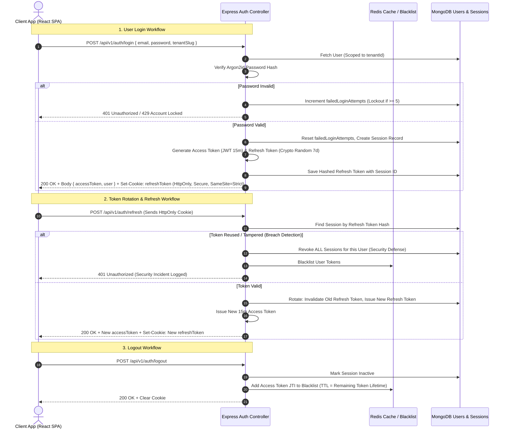

# API_DESIGN.md — REST API Architecture & Contracts Standard

**System Name:** EduSphere ERP  
**Document Version:** 1.0.0  
**Phase:** Phase 0 — Architecture & Engineering Blueprint  
**Base Path:** `/api/v1`  
**Protocol:** HTTPS / TLS 1.3  
**Data Format:** `application/json` (UTF-8)

---

## 1. API Design Philosophy & REST Conventions

### 1.1 URI Structure & Naming Conventions

1. **Predictable Resource URIs:**
   - Collections use lowercase, plural nouns: `/api/v1/students`, `/api/v1/classes`, `/api/v1/fee-invoices`.
   - Kebab-case for multi-word resources: `/api/v1/academic-years`, `/api/v1/timetable-periods`.
2. **Sub-Resource Nesting Rules:**
   - Allowed only for tightly-coupled, hierarchical entities up to 2 levels deep:
     - `GET /api/v1/classes/:classId/sections` (Fetch sections within a class)
     - `GET /api/v1/students/:studentId/enrollments` (Fetch academic history of student)
   - Avoid deep nesting anti-patterns (e.g., `/schools/:sId/campuses/:cId/classes/:clId/sections/:secId/students`). Instead, flatten to root resources with query filters:
     - `GET /api/v1/students?classId=xyz&sectionId=abc`
3. **Action & State Transition URIs:**
   - For non-CRUD business state transitions, append a verb to the resource instance:
     - `POST /api/v1/admissions/:id/approve`
     - `POST /api/v1/exams/:id/publish`
     - `POST /api/v1/fee-invoices/:id/void`

### 1.2 HTTP Verbs & Idempotency Matrix

| Verb       | Usage                                      | Idempotent | Safe | Expected Status Codes             |
| :--------- | :----------------------------------------- | :--------- | :--- | :-------------------------------- |
| **GET**    | Retrieve single resource or collection     | Yes        | Yes  | 200 OK, 304 Not Modified          |
| **POST**   | Create resource or execute workflow action | No         | No   | 201 Created, 202 Accepted, 200 OK |
| **PATCH**  | Apply partial field mutations to resource  | Yes        | No   | 200 OK, 404 Not Found             |
| **PUT**    | Completely replace resource state          | Yes        | No   | 200 OK, 201 Created               |
| **DELETE** | Soft-delete resource from active view      | Yes        | No   | 200 OK, 204 No Content            |

---

## 2. API Response & Error Standards

### 2.1 Unified Success Response Envelope

All successful API responses adhere strictly to this schema:

```json
{
  "success": true,
  "message": "Student enrollment created successfully.",
  "data": {
    "id": "66db6145a1980cf34b9281a1",
    "studentId": "66db6145a1980cf34b92819f",
    "classId": "66db5e21a1980cf34b928180",
    "sectionId": "66db5e2ca1980cf34b928185",
    "rollNumber": 14,
    "status": "ENROLLED"
  },
  "meta": {
    "requestId": "req_c9a1e482-628d-4f4c-bf62-421711202888",
    "timestamp": "2026-09-07T06:45:12.384Z",
    "pagination": {
      "page": 1,
      "limit": 20,
      "totalRecords": 1,
      "totalPages": 1,
      "hasNextPage": false,
      "hasPrevPage": false
    }
  }
}
```

### 2.2 Unified Error Response Envelope

Every client-facing or internal error is transformed into an RFC 7807-compliant structured envelope:

```json
{
  "success": false,
  "error": {
    "code": "VALIDATION_FAILED",
    "message": "Request payload failed schema validation constraints.",
    "details": [
      {
        "field": "personalDetails.dateOfBirth",
        "issue": "Student must be at least 3 years of age for nursery admission.",
        "received": "2025-05-10"
      },
      {
        "field": "contactDetails.primaryEmail",
        "issue": "Invalid email address format."
      }
    ],
    "requestId": "req_c9a1e482-628d-4f4c-bf62-421711202888",
    "timestamp": "2026-09-07T06:45:12.410Z"
  }
}
```

### 2.3 Error Code Taxonomy & HTTP Mapping

| HTTP Status | Error Code              | Description                                 | Typical Cause                                |
| :---------- | :---------------------- | :------------------------------------------ | :------------------------------------------- |
| **400**     | `BAD_REQUEST`           | Malformed syntax or unparseable JSON        | Broken JSON body, invalid URL query types    |
| **401**     | `UNAUTHORIZED`          | Missing or invalid authentication token     | Expired JWT, blacklisted token               |
| **401**     | `TOKEN_EXPIRED`         | Access token lifetime elapsed               | Triggers automatic refresh token cycle       |
| **403**     | `FORBIDDEN`             | Authenticated but lacks permissions         | Teacher attempting to void an invoice        |
| **403**     | `TENANT_MISMATCH`       | Token tenant does not match domain tenant   | Cross-tenant tampering attempt               |
| **404**     | `NOT_FOUND`             | Resource does not exist or is soft-deleted  | Unknown student ID                           |
| **409**     | `CONFLICT`              | State conflict or unique constraint failure | Duplicate roll number or admission number    |
| **422**     | `VALIDATION_FAILED`     | Zod schema validation constraints violated  | Missing required fields, invalid date ranges |
| **429**     | `RATE_LIMIT_EXCEEDED`   | Request velocity exceeded quota             | Excessive brute-force login attempts         |
| **500**     | `INTERNAL_SERVER_ERROR` | Unhandled server-side exception             | Database connection timeout, runtime bug     |
| **503**     | `SERVICE_UNAVAILABLE`   | Upstream dependency unreachable             | S3 unreachable, SMS gateway timeout          |

---

## 3. Querying, Filtering, Pagination & Search Conventions

### 3.1 Pagination Standards

1. **Offset Pagination (For standard UI tables with page selectors):**
   - Parameters: `?page=1&limit=25` (Default `limit=20`, Max `limit=100`).
   - Response `meta.pagination` supplies `totalPages`, `totalRecords`, `hasNextPage`.
2. **Cursor Pagination (For high-velocity audit logs, notification streams, attendance):**
   - Parameters: `?cursor=eyJpZCI6IjY2ZGI2...&limit=50`
   - Solves the offset skip performance degradation (`O(N)`) on million-row tables.

### 3.2 Filtering & Sorting Standards

- **Field Equality:** `?status=ACTIVE&classId=66db5e21a1980cf34b928180`
- **Range Lookups:** `?dueDate[gte]=2026-04-01&dueDate[lte]=2026-04-30`
- **Multi-Value Inclusions:** `?status=ACTIVE,PROMOTED`
- **Sorting:** `?sort=-createdAt,admissionNumber` (Prefix `-` indicates descending order).
- **Sparse Fieldsets (Projections):** `?fields=admissionNumber,personalDetails.firstName,currentStatus` (Reduces network payload).
- **Search:** `?search=sharma` (Triggers text index on candidate fields: first name, last name, phone, admission number).

---

## 4. Authentication Architecture & Token Lifecycle



### 4.1 Security Specifications for Authentication

1. **Access Tokens (JWT):**
   - **Lifetime:** 15 minutes.
   - **Payload:** `{ sub: userId, tenantId, schoolId, userType, roles: [roleId], jti: uuid }`.
   - **Storage:** Held exclusively in React client memory (Zustand store). **Never stored in localStorage or sessionStorage (protects against XSS token exfiltration).**
2. **Refresh Tokens:**
   - **Lifetime:** 7 days.
   - **Storage:** Issued as `HttpOnly`, `Secure`, `SameSite=Strict` cookie on path `/api/v1/auth/refresh`. JavaScript cannot read this cookie.
   - **Automatic Token Rotation:** Every single refresh generates a new refresh token and deletes the old one. If an old token is ever re-sent, the system flags a session hijack and invalidates the entire user's session tree immediately.
3. **Session Revocation & Device Management:**
   - Each login creates a `Session` document storing `userAgent`, `ipAddress`, `deviceId`, and `lastActive`.
   - Users can view all logged-in devices in their settings and click "Revoke Session" or "Revoke All Other Devices".

---

## 5. Rate Limiting Strategy

Rate limiting is applied at the Express middleware layer backed by a Redis sliding-window counter:

| Endpoint Category                                               | Window     | Max Requests                | Exceeded Behavior                            |
| :-------------------------------------------------------------- | :--------- | :-------------------------- | :------------------------------------------- |
| **Authentication (`/auth/login`, `/auth/forgot-password`)**     | 15 Minutes | 5 attempts per IP / Account | 429 Rate Limit Exceeded; 15-minute cooldown. |
| **Standard Authenticated APIs (`/students`, `/classes`, etc.)** | 1 Minute   | 180 requests per User       | 429 with `Retry-After` header.               |
| **Public Information (`/admissions/inquiry`)**                  | 1 Minute   | 30 requests per IP          | 429 with captcha challenge requirement.      |
| **Heavy File Exports (`/reports/export`, `/invoices/bulk-pdf`)  | 5 Minutes  | 6 requests per User         | Request queued or rejected with 429.         |
