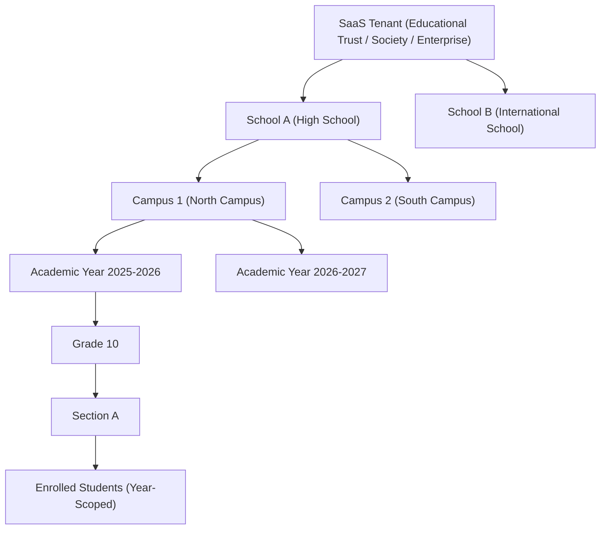
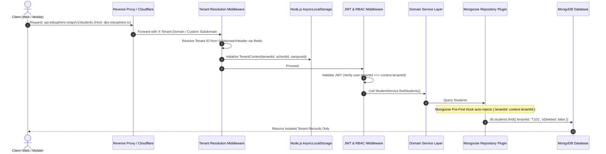
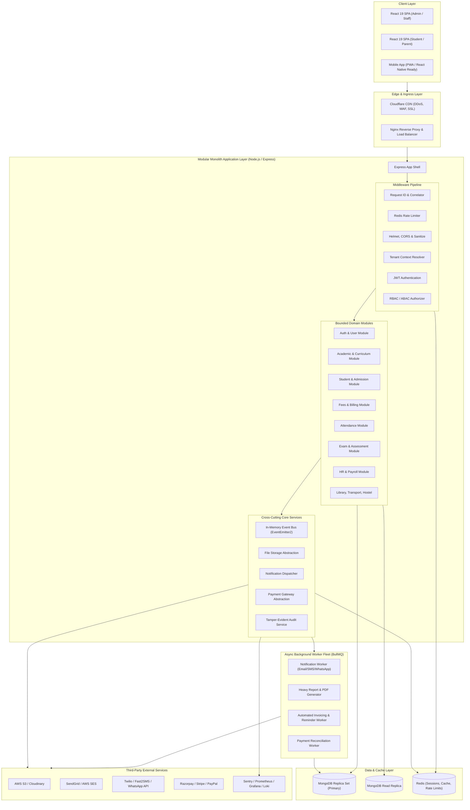
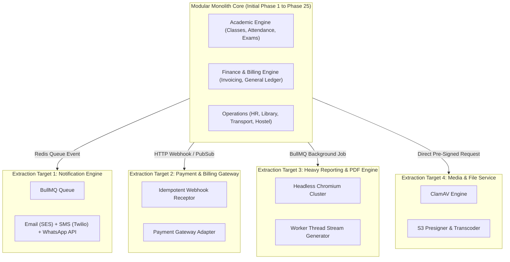

# ARCHITECTURE.md — System Architecture & Engineering Blueprint

**System Name:** EduSphere ERP (Multi-Tenant School Management Platform)  
**Document Version:** 1.0.0  
**Phase:** Phase 0 — Architecture & Engineering Blueprint  
**Date:** 2026-09-07  
**Status:** Approved Architectural Blueprint  

---

## 1. Product Vision & Problem Decomposition

### 1.1 Product Definition
EduSphere ERP is a production-grade, secure, multi-tenant School Management System / School ERP Software-as-a-Service (SaaS) platform built on the MERN stack (MongoDB, Express, React, Node.js) with TypeScript. The platform is architected to govern multi-school, multi-campus educational enterprises, accommodating hundreds of thousands of students, teachers, administrators, and parents with strict tenant data isolation, auditability, and regulatory compliance.

### 1.2 Primary & Secondary Users
* **Primary Stakeholders:**
  * **Super Admin (Platform Operator):** SaaS tenant provisioning, billing, feature toggling, platform-wide health monitoring.
  * **School Admin / Enterprise Owner:** Institutional configuration, academic year setups, campus management, global policy enforcement.
  * **Principals & Vice Principals:** Academic oversight, timetable approvals, teacher evaluation, performance analytics.
  * **Teachers / Academic Staff:** Daily attendance, lesson planning, assignment grading, examination mark entry, parent communication.
  * **Accountants / Finance Officers:** Fee structure setup, invoice generation, reconciliation, scholarship allocation, expense tracking, payroll.
  * **HR Managers:** Employee onboarding, leave management, attendance tracking, appraisal management, contract renewals.
  * **Students:** Timetable viewing, homework submission, exam schedules, online grade cards, library reservations, attendance history.
  * **Parents / Guardians:** Real-time fee payments, academic progress monitoring, live bus tracking, attendance alerts, teacher messaging.
* **Secondary / Operational Stakeholders:**
  * **Librarians:** Catalog management, barcode scanning, circulation tracking, overdue fines.
  * **Transport Managers:** Fleet management, GPS tracking integration, route optimization, vehicle maintenance.
  * **Hostel Managers:** Building and room allocation, bed occupancy, mess management, visitor gate passes.
  * **Receptionists & Front Office:** Visitor tracking, admissions inquiry, telephone logs, dispatch management.
  * **Compliance & External Auditors:** Immutable audit logs, tax and ledger exports, attendance certification.

### 1.3 Core Workflows
1. **Admissions to Enrollment:** Online inquiry → Document verification → Entrance exam/interview → Fee deposit → Automatic student profile creation, roll number generation, and section allocation.
2. **Academic Year Lifecycle:** Academic calendar creation → Term/Semester definition → Class/Section promotion rules → Historical snapshotting → Rollover of enrolled students.
3. **Daily Attendance to Alerting:** Teacher marks section attendance via mobile/web → Verification against biometric/RFID logs → Automatic absence webhook trigger → Immediate SMS/WhatsApp/Push notification to parents.
4. **Assessment & Grading:** Exam definition → Subject timetable scheduling → Seating allocation → Marks entry by subject teacher → Moderation & approval by Principal → Automated GPA/CBSE/ICSE/IB report card generation → Digital publishing to student/parent portal.
5. **Fee Billing & Reconciliation:** Fee schedule creation (tuition, transport, lab) → Automated invoice generation per student → Multi-gateway payment (Stripe/Razorpay) → Instant webhook verification → Ledger update + automated PDF receipt generation.
6. **HR & Payroll Processing:** Biometric staff attendance + approved leave sync → Salary slip calculation (allowances, tax deductions, PF/ESI) → Maker-checker approval → Batch disbursement record → Direct salary slip publication.

### 1.4 Architectural Differentiators (Why This Is NOT a "CRUD School App")
| Capability | Basic CRUD School App | EduSphere Enterprise ERP |
| :--- | :--- | :--- |
| **Tenancy** | Single-school, hardcoded database | Multi-tenant SaaS with domain/subdomain routing, strict query-level tenant isolation, and tenant-scoped caching. |
| **Authorization** | Hardcoded `if (user.role === 'admin')` | Fine-grained, decoupled RBAC + ABAC (`resource:action`) with custom roles, scoped permissions, and resource ownership checks. |
| **Financial Integrity** | Mutable `fees` table with overwrite updates | Immutable double-entry financial ledger, idempotent payment webhooks, reconciliation logs, and cryptographic invoice hashes. |
| **State Lifecycles** | Direct row updates (`status = 'passed'`) | Strict finite-state machines (FSM) enforcing transition rules (e.g., Admission: Draft → Submitted → Approved → Enrolled). |
| **Background Processing** | Synchronous blocking HTTP requests for emails/reports | Distributed queue (BullMQ/Redis) for asynchronous notification dispatch, PDF compilation, and bulk data processing. |
| **Data Relationships** | Flat relationships ignoring academic years | Temporal, year-scoped relations: Student enrollment, class allocation, and fee structures are anchored to specific `AcademicYearId`s. |
| **Auditing & Security** | No logs or basic console logging | System-wide immutable audit trail recording `actorId`, `tenantId`, `entity`, `before/after` delta diffs, IP, and RequestId. |

---

## 2. Multi-Tenant Architecture

### 2.1 Multi-Tenant Entity Hierarchy


* **Tenant:** The billing and organizational entity that contracts the SaaS platform (e.g., "Delhi Public Schools Society").
* **School:** A distinct educational institution under the tenant with independent regulatory affiliations (CBSE, ICSE, IB, State Board).
* **Campus / Branch:** Physical geographic site of a school operating distinct facilities, inventory, transport fleets, and hostel blocks.
* **Academic Year:** Temporal operational boundaries (e.g., April 1, 2026 – March 31, 2027). All academic data (classes, sections, enrollments, fees, attendance) is scoped to an Academic Year.

### 2.2 Comparison of Multi-Tenant Strategies

| Criteria | Strategy A: Shared DB + Tenant Discriminator | Strategy B: Database-per-Tenant | Strategy C: Hybrid Model (Recommended) |
| :--- | :--- | :--- | :--- |
| **Data Isolation** | Logical (enforced via query filters) | Physical (separate MongoDB databases) | Logical for Standard Tiers; Physical for VIP/Enterprise Tiers. |
| **Infrastructure Cost** | Lowest (maximum connection & resource pooling) | High (connection exhaustion, per-DB overhead) | Balanced (efficient resource utilization with tier segregation). |
| **Maintenance & Migrations** | Simple (single migration run across collections) | Complex (orchestrated migration across N DBs) | Automated worker migrates shared DB, then iterates isolated DBs. |
| **Noisy Neighbor Effect** | Requires aggressive rate limiting and indexing | Isolated at database engine level | High-load enterprise clients are shifted to dedicated databases. |
| **Backup & Restore** | Requires tenant-aware logical dump | Standard native MongoDB backup/restore per tenant | Single tenant restore feasible for enterprise; logical for shared. |

### 2.3 Selected Strategy & Technical Justification
**Selected Architecture:** **Hybrid Multi-Tenancy (Phase 1 begins with Shared Database + Strict Tenant Discriminator, architected for transparent Dynamic Connection Routing for Enterprise Tenants).**

* **Why this is optimal:** Starting with a pure database-per-tenant model creates operational friction: MongoDB connection pool limits in Node.js (max pool size per database connection), slow database migrations across hundreds of databases, and excessive memory overhead on idle tenants.
* **How it scales:** By decoupling database access through a centralized `TenantConnectionManager` and encapsulating all queries behind an AsyncLocalStorage-backed `TenantContext`, the codebase remains 100% agnostic to whether a query targets a shared collection or a dedicated tenant database.

### 2.4 Multi-Layer Tenant Isolation & Anti-Leakage Safeguards



1. **API / Resolution Level:**
   * Incoming HTTP requests resolve tenant identity via:
     1. Custom Domain (`portal.greenwoodhigh.edu`) or Subdomain (`greenwood.edusphere.io`).
     2. Explicit Header (`X-Tenant-ID`) for mobile applications (signed and validated against API key/session).
2. **Context Propagation Level (AsyncLocalStorage):**
   * Express middleware wraps execution in a Node.js `AsyncLocalStorage` store holding `{ tenantId, schoolId, campusId, userId }`.
   * Downstream services never require manual passing of `tenantId` in function arguments, eliminating human error.
3. **Repository & Query Isolation (Mongoose Global Plugin):**
   * A universal tenant plugin is applied to every tenant-aware schema:
     * **Pre-Find / Count / Aggregate Hooks:** Automatically appends `{ tenantId: currentTenantId() }` to all query criteria.
     * **Pre-Save / Insert Hooks:** Automatically stamps the document with `tenantId: currentTenantId()`. If an incoming payload contains a conflicting `tenantId`, the operation throws an unrecoverable `SecurityTamperingError`.
     * **Immutability:** The `tenantId` field is configured with `immutable: true` in Mongoose schema options, preventing mutations after document creation.
4. **Super Admin Cross-Tenant Controls:**
   * Super Admins operating from the platform control plane must supply explicit impersonation context tokens (`X-Impersonate-Tenant-ID`) which are strictly verified, time-limited, and audited in the immutable security log.

---

## 3. High-Level System Architecture



### 3.1 Layer Responsibilities & Boundaries

1. **Edge & Ingress Layer (Cloudflare + Nginx):**
   * SSL termination, HTTP/2 to HTTP/1.1 multiplexing, gzip/brotli compression.
   * IP reputation filtering, volumetric DDoS defense, and path-based routing.
2. **Middleware Pipeline Layer:**
   * `RequestCorrelator`: Generates/propagates unique UUIDv4 `X-Request-ID` across all logs.
   * `SecurityMiddleware`: Implements OWASP security headers (Content Security Policy, HSTS, X-Frame-Options, No-Sniff) via Helmet.
   * `TenantContextResolver`: Extracts host domain/subdomain, loads tenant metadata from Redis cache, and initializes `TenantContext` in AsyncLocalStorage.
   * `AuthenticationMiddleware`: Validates asymmetric or HMAC signed JWTs, verifies token blacklist against Redis, attaches active session identity.
   * `RBACMiddleware`: Evaluates evaluated user permissions against route requirements.
3. **Controllers Layer (Presentation):**
   * Strictly responsible for HTTP request handling: extracting params, query, and body.
   * Request validation via Zod schemas; rejects malformed inputs with uniform 422/400 errors.
   * Invokes service methods and formats responses using the standardized JSON API envelope.
   * **Zero business logic and zero database queries allowed in controllers.**
4. **Service Layer (Domain Business Logic):**
   * Encapsulates all domain rules, calculations, workflow state transitions, and authorization constraints.
   * Coordinates multi-entity business transactions (e.g., admitting a student creates a User, a StudentProfile, an Enrollment record, and an initial Fee Invoice inside a MongoDB session transaction).
   * Emits domain events (`student.enrolled`, `fee.paid`) onto the application EventBus.
5. **Repository / Data Access Layer:**
   * Abstraction over Mongoose models. Handles database reads, writes, projections, indexing hints, and pagination cursors.
   * Enforces tenancy filters and soft-delete filters (`isDeleted: false`) systematically.
6. **Background Worker Layer (BullMQ):**
   * Runs out-of-process from the web API server.
   * Consumes jobs from Redis queues with exponential backoff, dead-letter queues (DLQ), and failure alerts.

---

## 4. Modular Monolith Architecture Strategy

### 4.1 Modular Monolith vs. Early Microservices
* **The Microservices Anti-Pattern for Initial Startups:** Premature microservices introduce distributed transaction complexity (Saga pattern, two-phase commits), eventual consistency edge cases in financial workflows, high latency overhead across internal RPCs, and massive DevOps maintenance overhead.
* **The Modular Monolith Solution:** We build a single deployable unit structured with strict, decoupled module boundaries.
  * Modules communicate across boundaries exclusively via:
    1. Public service interfaces (contract APIs).
    2. Asynchronous in-memory / queue domain events.
  * Direct cross-module database collection joins or internal private repository access are strictly forbidden by architectural linting rules.

### 4.2 Module Directory & Boundary Standard
Every domain module adheres to an identical internal layout:
```
apps/api/src/modules/<module-name>/
├── controllers/          # HTTP transport layer (Zod validation, status codes)
├── services/             # Pure domain logic & orchestration
├── repositories/         # Database access layer (Mongoose queries)
├── models/               # Mongoose schema definitions
├── dtos/                 # Input/output contracts (Zod schemas & TS types)
├── events/               # Domain event definitions and listeners
├── interfaces/           # Public contracts exposed to other modules
└── index.ts              # Public module entrypoint (exports ONLY approved interfaces)
```

---

## 5. Domain Relationship Map

```mermaid
erDiagram
    TENANT ||--o{ SCHOOL : owns
    SCHOOL ||--o{ CAMPUS : operates
    CAMPUS ||--o{ ACADEMIC_YEAR : configures
    ACADEMIC_YEAR ||--o{ CLASS : contains
    CLASS ||--o{ SECTION : divides_into
    SECTION ||--o{ STUDENT_ENROLLMENT : holds
    
    USER ||--o{ USER_ROLE : assigned
    ROLE ||--o{ USER_ROLE : contains
    ROLE ||--o{ ROLE_PERMISSION : grants
    PERMISSION ||--o{ ROLE_PERMISSION : defines
    
    USER ||--o| STUDENT : profiles
    USER ||--o| TEACHER : profiles
    USER ||--o| PARENT : profiles
    USER ||--o| STAFF : profiles

    PARENT ||--o{ STUDENT_PARENT_RELATION : links
    STUDENT ||--o{ STUDENT_PARENT_RELATION : linked_to
    
    TEACHER ||--o{ TIMETABLE_PERIOD : assigned_to
    SECTION ||--o{ TIMETABLE_PERIOD : scheduled_for
    SUBJECT ||--o{ TIMETABLE_PERIOD : teaches

    STUDENT ||--o{ ATTENDANCE : records
    SECTION ||--o{ ATTENDANCE : tracks
    
    STUDENT ||--o{ HOMEWORK_SUBMISSION : submits
    HOMEWORK ||--o{ HOMEWORK_SUBMISSION : collects
    SECTION ||--o{ HOMEWORK : assigned_to
    
    EXAM ||--o{ EXAM_SCHEDULE : schedules
    EXAM_SCHEDULE ||--o{ MARKS_ENTRY : records
    STUDENT ||--o{ MARKS_ENTRY : achieves
    STUDENT ||--o{ REPORT_CARD : receives

    FEE_STRUCTURE ||--o{ FEE_INVOICE : generates
    STUDENT ||--o{ FEE_INVOICE : billed
    FEE_INVOICE ||--o{ PAYMENT_TRANSACTION : collects
    
    STAFF ||--o{ STAFF_ATTENDANCE : logs
    STAFF ||--o{ LEAVE_REQUEST : requests
    STAFF ||--o{ PAYROLL_RECORD : paid_via

    STUDENT ||--o{ LIBRARY_LOAN : borrows
    BOOK_COPY ||--o{ LIBRARY_LOAN : lent

    STUDENT ||--o{ TRANSPORT_ALLOCATION : boards
    VEHICLE_ROUTE ||--o{ TRANSPORT_ALLOCATION : transports
    ROUTE_STOP ||--o{ TRANSPORT_ALLOCATION : picks_up

    STUDENT ||--o{ HOSTEL_ALLOCATION : resides
    ROOM_BED ||--o{ HOSTEL_ALLOCATION : occupies
```

### 5.1 Critical Cross-Domain Invariants
1. **Student Year Scope:** A `Student` entity represents the persistent human profile. A `StudentEnrollment` record links the `Student` to a specific `SchoolId`, `CampusId`, `AcademicYearId`, `ClassId`, and `SectionId`. Grade advancement generates a new `StudentEnrollment` without altering historical academic records.
2. **Parent-Student Decoupling:** Parents are independent `User` entities linked to one or more `Student` records via `StudentParentRelation` with relationship attributes (`father`, `mother`, `legal_guardian`, `primary_fee_payer`, `emergency_contact`).
3. **Academic-Financial Decoupling:** Fee structures are bound to `AcademicYear` and `Class`, but invoice generation creates an immutable ledger document (`FeeInvoice`). Subsequent changes to school fee structures do not mutate existing issued invoices.

---

## 6. Core Modules Blueprint

The platform is structured into 36 cohesive modules:

| # | Module Name | Core Responsibility | Key Entities | Primary Dependencies | Public API Boundaries |
| :--- | :--- | :--- | :--- | :--- | :--- |
| 1 | **Auth** | Identity, authentication, sessions, MFA, token rotation | `User`, `Session`, `RefreshToken` | Redis, UserModule | `/api/v1/auth/*` |
| 2 | **Users** | User management, profile lifecycles, account lockouts | `User`, `UserProfile` | Auth, Storage | `/api/v1/users/*` |
| 3 | **RBAC** | Dynamic roles, permission catalog, role assignment | `Role`, `Permission`, `UserRole` | Users, Cache | `/api/v1/rbac/*` |
| 4 | **Tenants** | Multi-tenant provisioning, domains, subscription tiers | `Tenant`, `TenantSubscription` | Core, Billing | `/api/v1/tenants/*` |
| 5 | **Schools** | School profiles, regulatory boards, institutional settings | `School`, `SchoolSetting` | Tenants | `/api/v1/schools/*` |
| 6 | **Campuses** | Physical branches, facilities, geographic configurations | `Campus`, `Facility` | Schools | `/api/v1/campuses/*` |
| 7 | **Academic Years** | Academic calendar, term dates, enrollment promotion rules | `AcademicYear`, `Term` | Campuses | `/api/v1/academic-years/*` |
| 8 | **Classes & Sections**| Grade structures, division sections, student capacities | `Class`, `Section` | AcademicYears | `/api/v1/classes/*` |
| 9 | **Subjects** | Curriculum subjects, elective groups, credit hours | `Subject`, `Curriculum` | Classes | `/api/v1/subjects/*` |
| 10 | **Admissions** | Inquiry pipeline, application reviews, document checks | `AdmissionInquiry`, `Application` | Students, Finance | `/api/v1/admissions/*` |
| 11 | **Students** | Permanent student identity, health details, lifecycles | `Student`, `StudentEnrollment` | Classes, Sections | `/api/v1/students/*` |
| 12 | **Parents** | Guardian records, emergency contacts, parent portal | `Parent`, `StudentParentMap` | Students, Users | `/api/v1/parents/*` |
| 13 | **Teachers** | Faculty profiles, qualifications, subject competencies | `Teacher`, `TeacherAssignment` | Users, Subjects | `/api/v1/teachers/*` |
| 14 | **Staff & HR** | Non-teaching employee records, employment contracts | `Staff`, `EmploymentContract` | Users, Payroll | `/api/v1/staff/*` |
| 15 | **Timetable** | Period scheduling, teacher conflict checks, rooms | `Timetable`, `PeriodAllocation` | Classes, Teachers | `/api/v1/timetables/*` |
| 16 | **Attendance** | Student & staff daily logs, biometrics, absence alerts | `AttendanceRecord`, `AbsenceLog` | Students, Staff | `/api/v1/attendance/*` |
| 17 | **Homework** | Assignments, attachments, submissions, evaluations | `Homework`, `Submission` | Classes, Storage | `/api/v1/homework/*` |
| 18 | **Exams** | Examination cycles, schedules, hall tickets, seatings | `Exam`, `ExamSchedule` | AcademicYears | `/api/v1/exams/*` |
| 19 | **Marks & Results** | Score entry, grade rubrics, moderation, validations | `MarksEntry`, `GradeRubric` | Exams, Students | `/api/v1/marks/*` |
| 20 | **Report Cards** | Automated GPA calculation, remarks, PDF publishing | `ReportCard`, `ReportTemplate` | Results, Storage | `/api/v1/report-cards/*` |
| 21 | **Fee Structures** | Fee heads, schedules, discount categories, installments| `FeeCategory`, `FeeStructure` | AcademicYears | `/api/v1/fee-structures/*` |
| 22 | **Invoices & Billing**| Student billing, fines, concession workflows | `FeeInvoice`, `InvoiceItem` | FeeStructures | `/api/v1/invoices/*` |
| 23 | **Payments** | Gateway webhooks, receipts, idempotent transactions | `Payment`, `RefundTransaction` | Invoices, Gateways | `/api/v1/payments/*` |
| 24 | **Finance** | General ledger, charts of accounts, expense vouchers | `LedgerAccount`, `Voucher` | Payments, Payroll | `/api/v1/finance/*` |
| 25 | **Payroll** | Salary structures, deductions, payslips, approvals | `SalaryStructure`, `Payslip` | Staff, Attendance | `/api/v1/payroll/*` |
| 26 | **Leave Management** | Staff leave entitlements, applications, approvals | `LeaveType`, `LeaveRequest` | Staff, Teachers | `/api/v1/leaves/*` |
| 27 | **Library** | ISBN cataloging, barcode assets, loan circulations | `Book`, `BookCopy`, `LoanRecord` | Students, Staff | `/api/v1/library/*` |
| 28 | **Transport** | Fleet vehicles, route coordinates, stops, passenger maps| `Vehicle`, `Route`, `Stop` | Students, Staff | `/api/v1/transport/*` |
| 29 | **Hostel** | Buildings, room types, bed allocations, gate passes | `HostelBuilding`, `RoomBed` | Students | `/api/v1/hostel/*` |
| 30 | **Inventory** | School assets, vendor tracking, purchase orders | `InventoryItem`, `PurchaseOrder` | Finance | `/api/v1/inventory/*` |
| 31 | **Communication** | Circulars, announcements, direct messaging, groups | `Announcement`, `MessageThread` | Users, Push | `/api/v1/communication/*` |
| 32 | **Notifications** | Multichannel dispatch (Push, Email, SMS, WhatsApp) | `Notification`, `Template` | Queues, SMS | `/api/v1/notifications/*` |
| 33 | **Reports & Analytics**| Institutional BI, cohort retention, financial analytics | `ReportConfig`, `ExportJob` | All Modules | `/api/v1/reports/*` |
| 34 | **Audit Logging** | Cryptographically chained, immutable change log | `AuditLog` | All Modules | `/api/v1/audit/*` |
| 35 | **File Storage** | Presigned uploads, virus scanning, CDN resolution | `FileRecord`, `BucketConfig` | S3, Cloudinary | `/api/v1/files/*` |
| 36 | **Global Search** | Fast faceted search across students, staff, invoices | Search Indices | Mongo Text/Atlas | `/api/v1/search/*` |

---

## 7. Scalability & Microservices Extraction Blueprint



### 7.1 Growth Roadmap: 1 to 1000+ Schools
1. **Tier 1 (1 - 10 Schools, <15,000 Active Users):**
   * Single Docker Compose / ECS cluster running Node.js modular monolith.
   * Single MongoDB Replica Set (1 Primary, 2 Secondaries) with high-memory caching.
   * Managed Redis (standalone or primary/replica) for BullMQ queues and cache.
2. **Tier 2 (10 - 100 Schools, 150,000 Active Users):**
   * Horizontally auto-scaled Node.js API pods behind an Application Load Balancer.
   * Read-heavy traffic (reports, attendance lookups, student timetables) directed to MongoDB Secondary Read Replicas via `readPreference: 'secondaryPreferred'`.
   * Separate BullMQ background worker pods to ensure report compilation does not degrade API latency.
3. **Tier 3 (100 - 1000+ Schools, 1,000,000+ Active Users):**
   * Dedicated MongoDB cluster per enterprise tenant tier or MongoDB Sharding keyed by `{ tenantId: 'hashed' }`.
   * Microservice extraction of:
     1. Notification Service (high-frequency WhatsApp/SMS bursts during morning attendance).
     2. Report Generation Service (memory-intensive Chromium PDF clusters).
     3. Payment Webhook Processor (high-concurrency fee deadline spikes).
   * Redis Cluster for distributed rate limiting and multi-region session cache.

---

## 8. Non-Functional Requirements & Engineering Targets

| Metric | Target SLA | Strategy / Enforcement |
| :--- | :--- | :--- |
| **Availability** | 99.9% Uptime (Excluding scheduled maintenance) | Multi-AZ container deployment, health check probes (`/health`, `/ready`), automated zero-downtime rolling updates. |
| **API Latency (p95)** | < 150ms for standard CRUD queries | Compound indexing on all queries, lean Mongoose projections, Redis cache for configurations. |
| **API Latency (p99)** | < 400ms for complex aggregation queries | Secondary replica routing, indexed pre-aggregations, cursor-based pagination. |
| **Data Isolation** | 0.00% cross-tenant data leakage | Mongoose pre-hook query validation, immutable tenantId enforcement, automated integration security testing. |
| **Throughput** | 2,500 requests/sec per API cluster node | Non-blocking asynchronous I/O, lean payloads, gzip/brotli compression. |
| **Recovery Point (RPO)** | < 15 minutes | Continuous MongoDB point-in-time oplog backups to secondary cloud region. |
| **Recovery Time (RTO)** | < 2 hours | Automated Infrastructure-as-Code (Terraform/Docker) restore scripts and automated failover. |
| **Accessibility** | WCAG 2.1 Level AA Compliance | Semantic HTML5, Radix UI accessible primitives, high-contrast ratios, complete keyboard accessibility. |
| **Security Standards** | OWASP Top 10 Zero-Vulnerability | Strict CSP headers, token rotation, parameterized queries, rate limiting, and encrypted at-rest storage (AES-256). |
