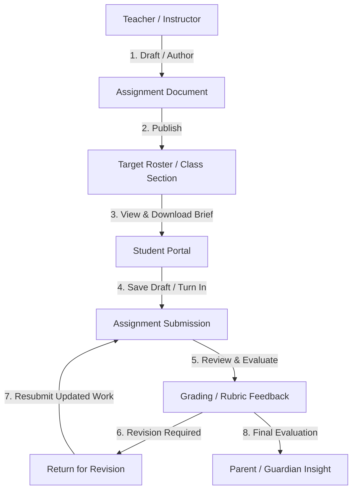
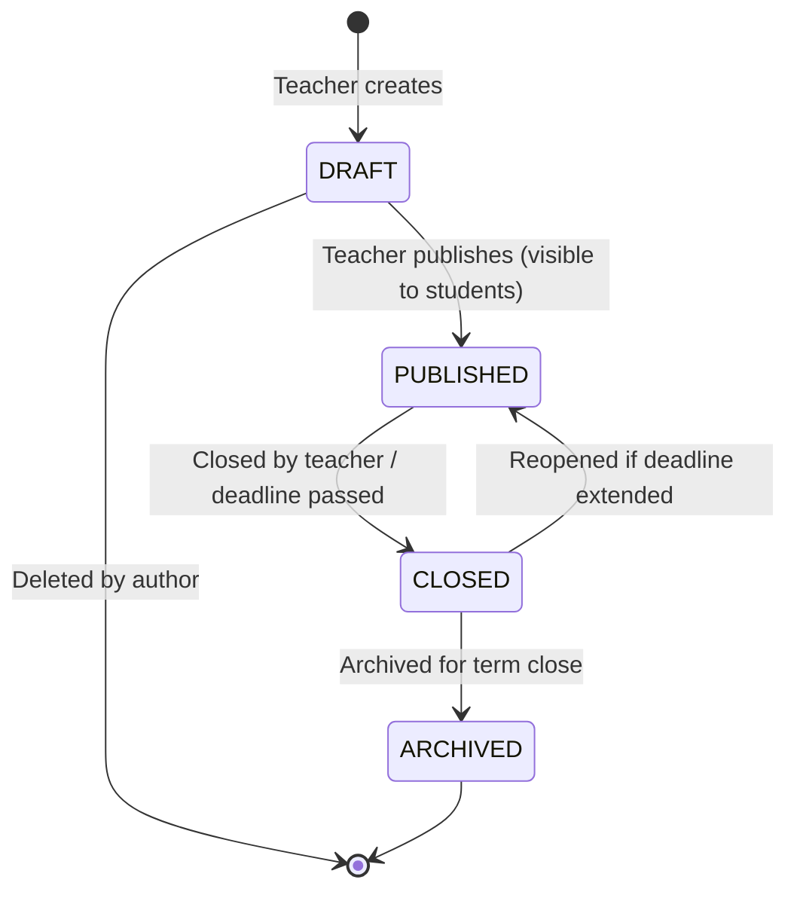

# ASSIGNMENT_MANAGEMENT.md — Assignment & Homework Architecture & Lifecycle

**Document Version:** 1.0.0  
**Active Phase:** Phase 11 — Homework & Assignment Management  
**Date:** September 14, 2026  
**Status:** Production Grade  

---

## 1. Domain Architecture Overview

The EduSphere Homework & Assignment subsystem provides an enterprise-grade academic evaluation engine supporting teachers, students, parents, and academic administrators. It enforces strict multi-tenant isolation, fine-grained Role-Based Access Control (RBAC), and Attribute-Based Access Control (ABAC) to guarantee privacy, prevent IDOR vulnerabilities, and eliminate concurrency race conditions.



---

## 2. Core Entities & Data Model

### 2.1 Assignment Entity (`assignments` collection)

The `Assignment` entity (aliased as `Homework` for backwards compatibility) defines the academic task created by teachers:

| Field | Type | Description |
| :--- | :--- | :--- |
| `tenantId` | `ObjectId` | Multi-tenant partition key (indexed) |
| `schoolId` | `ObjectId` | Reference to institutional school |
| `campusId` | `ObjectId` | Specific campus location |
| `academicYearId` | `ObjectId` | Current academic session |
| `classId` | `ObjectId` | Base grade/class |
| `sectionId` | `ObjectId` | Section division |
| `academicClassId` | `ObjectId` | Academic class offering mapping |
| `subjectId` | `ObjectId` | Subject curriculum reference |
| `teacherId` | `ObjectId` | Authoring teacher profile ID |
| `title` | `string` | Assignment headline / topic |
| `description` | `string` | Markdown / formatted prompt instructions |
| `assignmentType` | `enum` | `HOMEWORK`, `PROJECT`, `PRACTICE`, `ESSAY`, `LAB_REPORT` |
| `submissionType` | `enum` | `ONLINE_TEXT`, `ONLINE_FILE`, `BOTH`, `OFFLINE` |
| `targetType` | `enum` | `ALL` (entire class) or `SPECIFIC_STUDENTS` |
| `targetStudentIds` | `ObjectId[]` | Specific enrolled students when targeted |
| `assignedDate` | `Date` | Date assigned to students |
| `dueDate` | `Date` | Official deadline for submission |
| `allowLateSubmission` | `boolean` | Whether submissions after `dueDate` are accepted |
| `lateSubmissionDeadline` | `Date?` | Hard cutoff date for late submissions |
| `latePenaltyPercent` | `number` | Penalty deduction percentage (0–100%) |
| `maxScore` | `number` | Maximum evaluation points (e.g. 100) |
| `passingScore` | `number?` | Threshold score to satisfy passing criteria |
| `attachments` | `Attachment[]` | Teacher prompt reference files (name, url, size, mimeType) |
| `status` | `enum` | `DRAFT`, `PUBLISHED`, `CLOSED`, `ARCHIVED` |
| `publishedAt` | `Date?` | Timestamp when published to students |
| `closedAt` | `Date?` | Timestamp when closed |

### 2.2 Assignment Submission Entity (`assignmentsubmissions` collection)

The `AssignmentSubmission` records individual student work, versioned attempts, and teacher grading:

| Field | Type | Description |
| :--- | :--- | :--- |
| `tenantId` | `ObjectId` | Multi-tenant partition key |
| `assignmentId` | `ObjectId` | Reference to parent Assignment |
| `studentId` | `ObjectId` | Reference to enrolled Student profile |
| `status` | `enum` | `DRAFT`, `SUBMITTED`, `LATE`, `RESUBMITTED`, `GRADED`, `RETURNED` |
| `submittedAt` | `Date?` | Submission timestamp |
| `isLate` | `boolean` | Calculated against assignment `dueDate` |
| `content` | `string?` | Student rich text response |
| `attachments` | `Attachment[]` | Student uploaded artifact files |
| `attemptNumber` | `number` | Attempt counter (0 for draft, 1+ for submissions) |
| `attempts` | `Attempt[]` | Snapshot history of previous submission attempts |
| `score` | `number?` | Awarded grade points |
| `feedback` | `string?` | Teacher evaluation commentary |
| `gradedById` | `ObjectId?` | Teacher or admin who evaluated |
| `gradedAt` | `Date?` | Grading timestamp |
| `returnedAt` | `Date?` | Timestamp if returned for revision |
| `returnReason` | `string?` | Mandatory teacher explanation for revision |
| `idempotencyKey` | `string?` | Anti-duplicate submission token |

### 2.3 Compound Unique Indexes & Invariants

```typescript
// Compound unique index ensuring one submission record per student per assignment
assignmentSubmissionSchema.index(
  { tenantId: 1, assignmentId: 1, studentId: 1 },
  { unique: true }
);

// Idempotency constraint ensuring safe retry over network boundaries
assignmentSubmissionSchema.index(
  { tenantId: 1, idempotencyKey: 1 },
  { unique: true, sparse: true }
);
```

---

## 3. Assignment Lifecycle State Machine

Assignments follow a deterministic lifecycle:



1. **`DRAFT`**:
   - Only visible to the authoring teacher and authorized academic administrators.
   - Fully editable and deletable.
   - Inactive for student rosters and parent dashboards.
2. **`PUBLISHED`**:
   - Visible to all targeted students and their linked parents.
   - Accepting student drafts and final submissions.
   - Cannot change `targetType` or `classId` once active submissions exist.
3. **`CLOSED`**:
   - Direct submissions blocked unless explicitly reopened.
   - Teachers may finish grading and returning submissions.
4. **`ARCHIVED`**:
   - Read-only historical ledger record for compliance and grade reporting.

---

## 4. API Endpoints

Mounted at `/api/v1/assignments`:

| Method | Endpoint | Description | Guard / Permission |
| :--- | :--- | :--- | :--- |
| `GET` | `/` | List assignments (paginated, filtered) | `assignment:read` |
| `POST` | `/` | Create assignment draft | `assignment:create` |
| `GET` | `/dashboard` | Role-specific assignment dashboard | `assignment:read` |
| `GET` | `/:id` | Get assignment details by ID | `assignment:read` |
| `PUT` | `/:id` | Update assignment details | `assignment:update` |
| `DELETE` | `/:id` | Delete assignment draft | `assignment:delete` |
| `POST` | `/:id/publish` | Publish assignment to students | `assignment:publish` |
| `POST` | `/:id/close` | Close assignment | `assignment:close` |
| `POST` | `/:id/archive` | Archive assignment | `assignment:archive` |
| `GET` | `/:id/submissions` | List submissions for an assignment | `submission:read` |
| `GET` | `/:id/my-submission` | Get student's own submission | `submission:read` |
| `POST` | `/:id/submissions/draft` | Save student draft solution | `submission:update` |
| `POST` | `/:id/submissions` | Submit student solution | `submission:create` |
| `POST` | `/:id/submissions/:subId/grade`| Grade submission | `submission:grade` |
| `POST` | `/:id/submissions/:subId/return`| Return submission for revision | `submission:return` |
