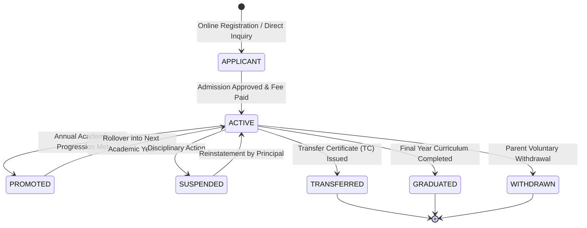
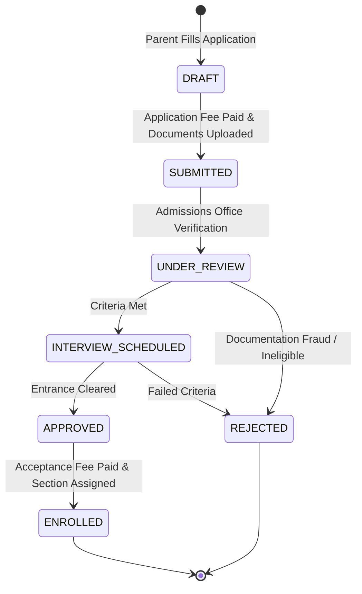
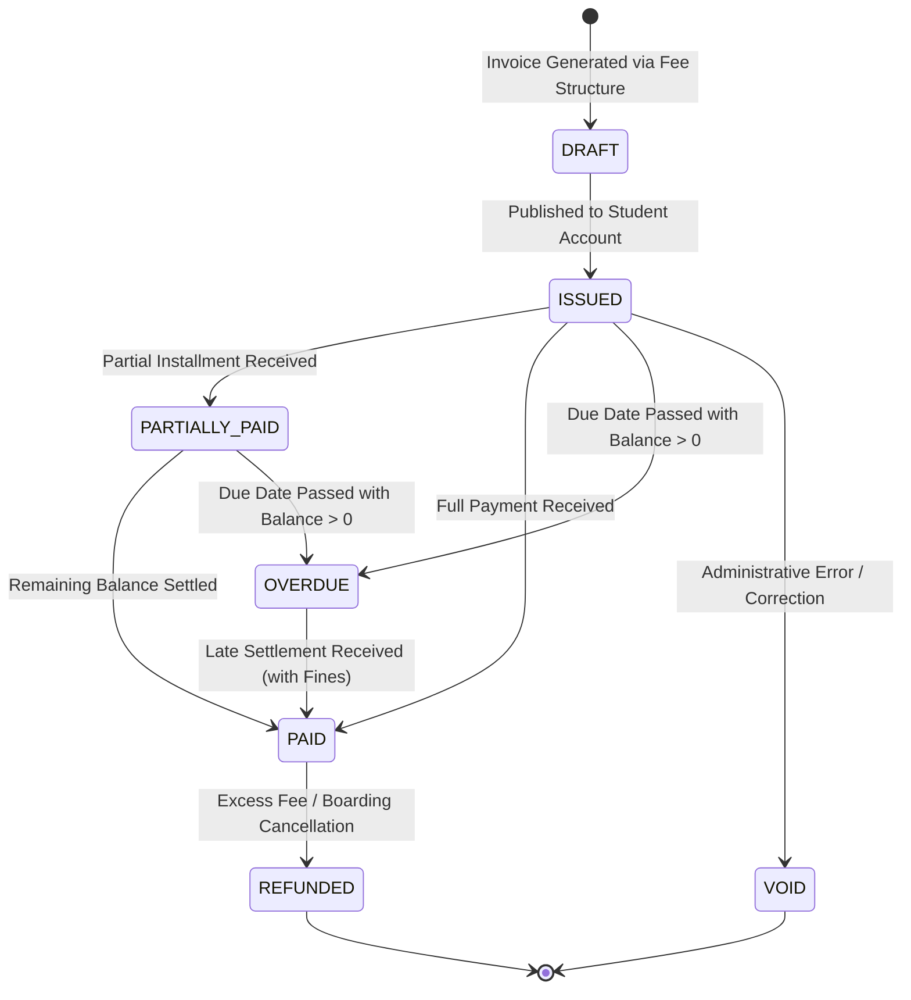
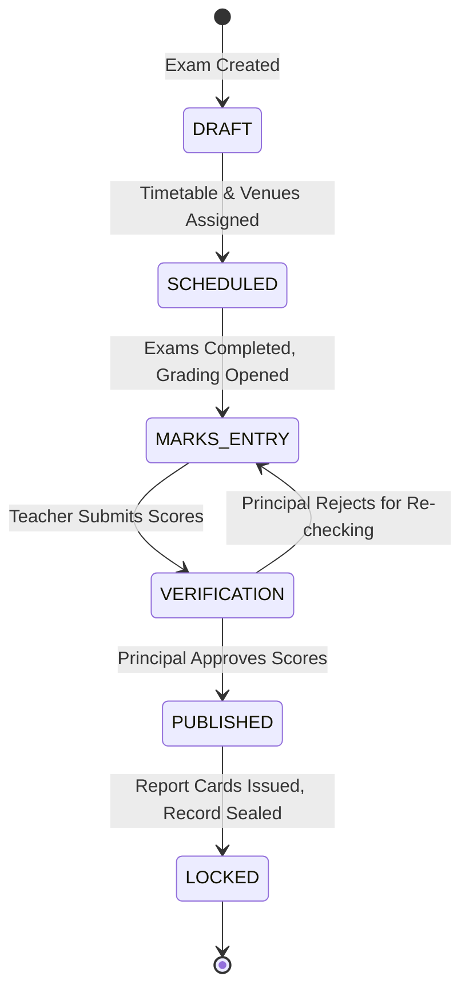

# DATABASE_DESIGN.md — MongoDB Architecture & Schema Blueprint

**System Name:** EduSphere ERP  
**Document Version:** 1.0.0  
**Phase:** Phase 0 — Architecture & Engineering Blueprint  
**Database Engine:** MongoDB 7.0+ (Replica Set)  
**ORM/ODM:** Mongoose 8.6+ with Strict Schema Validation

---

## 1. MongoDB Architecture Principles & Modeling Philosophy

### 1.1 The Anti-Pattern: Relational SQL Thinking in MongoDB

A common failure in Node.js/MongoDB systems is modeling MongoDB as a direct copy of a relational SQL database with pure normalization, or conversely, recklessly embedding unbounded arrays into single documents.

- **Unbounded Array Anti-Pattern:** Storing all attendance records or fee payments inside a single `Student` document. As a student attends school for 10+ years, the document breaches MongoDB's 16MB BSON limit and causes severe write amplification.
- **Over-Normalization Anti-Pattern:** Creating separate collections for addresses, phone numbers, and emergency contacts, necessitating 8-way `$lookup` aggregations for simple profile fetches.

### 1.2 The EduSphere Modeling Standard: Embedding vs. Referencing Rules

1. **Embed When:**
   - Data is strictly 1-to-1 or bounded 1-to-Few (e.g., student emergency contacts: max 3-5 items).
   - Data is always queried and written alongside the parent document (e.g., street address, guardian details).
   - Data represents a point-in-time snapshot (e.g., invoice line items freezing fee names and rates at time of billing).
2. **Reference When:**
   - Data has 1-to-Many or Many-to-Many cardinality that grows continuously over time (e.g., attendance records, library loans, fee payments).
   - Referenced entities are queried independently in high-throughput workflows (e.g., section attendance queries without loading full student profiles).
   - Entities have distinct operational lifecycles (e.g., `ExamSchedule` vs. `Exam`, `Payment` vs. `FeeInvoice`).

### 1.3 Universal Data Invariants

Every collection in EduSphere implements these base fields:

```typescript
interface IBaseEntity {
  _id: mongoose.Types.ObjectId;
  tenantId: mongoose.Types.ObjectId; // Immutable tenant ownership discriminator
  schoolId?: mongoose.Types.ObjectId; // Optional institutional scope
  campusId?: mongoose.Types.ObjectId; // Optional physical site scope
  isDeleted: boolean; // Universal soft delete flag
  deletedAt?: Date; // Timestamp of soft delete
  deletedBy?: mongoose.Types.ObjectId; // User ID who performed soft delete
  version: number; // Optimistic concurrency control (OCC)
  createdAt: Date;
  updatedAt: Date;
}
```

---

## 2. Complete Database Collection Inventory

The database architecture defines **48 normalized collections**, structured into 10 logical domain clusters:

| Domain Cluster             | Collections Included                                                                                                                                                                               |
| :------------------------- | :------------------------------------------------------------------------------------------------------------------------------------------------------------------------------------------------- |
| **1. Identity & Access**   | `users`, `roles`, `permissions`, `userRoles`, `rolePermissions`, `sessions`, `refreshTokens`                                                                                                       |
| **2. Multi-Tenant Core**   | `tenants`, `schools`, `campuses`, `academicYears`                                                                                                                                                  |
| **3. Academic Hierarchy**  | `classes`, `sections`, `subjects`, `curriculums`, `timetables`, `timetablePeriods`                                                                                                                 |
| **4. Student & Parents**   | `admissions`, `students`, `studentEnrollments`, `parents`, `studentParentRelations`                                                                                                                |
| **5. Human Resources**     | `teachers`, `teacherAssignments`, `staff`, `employmentContracts`, `leaveTypes`, `leaveRequests`                                                                                                    |
| **6. Daily Operations**    | `attendanceRecords`, `homework`, `homeworkSubmissions`, `announcements`, `messageThreads`                                                                                                          |
| **7. Examinations**        | `exams`, `examSchedules`, `marksEntries`, `reportCards`, `gradeRubrics`                                                                                                                            |
| **8. Fees & Finance**      | `feeCategories`, `feeStructures`, `feeInvoices`, `payments`, `refunds`, `ledgerAccounts`, `vouchers`                                                                                               |
| **9. Facilities & Assets** | `books`, `bookCopies`, `libraryLoans`, `vehicles`, `routes`, `routeStops`, `transportAllocations`, `hostelBuildings`, `rooms`, `roomBeds`, `hostelAllocations`, `inventoryItems`, `purchaseOrders` |
| **10. Platform Core**      | `files`, `notifications`, `notificationTemplates`, `auditLogs`                                                                                                                                     |

---

## 3. Schema Specifications for Major Collections

### 3.1 `users`

- **Purpose:** Central credential and primary identity store for all system actors.
- **Fields:**
  - `tenantId`: ObjectId (Ref: `tenants`, required, immutable)
  - `email`: String (lowercase, trimmed, required)
  - `phone`: String (E.164 format, optional)
  - `passwordHash`: String (Argon2id hash, required)
  - `userType`: Enum (`SUPER_ADMIN`, `SCHOOL_ADMIN`, `PRINCIPAL`, `TEACHER`, `ACCOUNTANT`, `HR_MANAGER`, `LIBRARIAN`, `TRANSPORT_MANAGER`, `HOSTEL_MANAGER`, `RECEPTIONIST`, `STAFF`, `STUDENT`, `PARENT`)
  - `status`: Enum (`PENDING_VERIFICATION`, `ACTIVE`, `SUSPENDED`, `LOCKED`, `DEACTIVATED`)
  - `failedLoginAttempts`: Number (default: 0)
  - `lockoutUntil`: Date (nullable)
  - `mfaEnabled`: Boolean (default: false)
  - `mfaSecret`: String (encrypted, optional)
  - `lastLoginAt`: Date
  - `isDeleted`: Boolean (default: false)
- **Indexes:**
  - `{ tenantId: 1, email: 1 }` (Unique, partialFilterExpression: `{ isDeleted: false }`)
  - `{ tenantId: 1, phone: 1 }` (Sparse, partialFilterExpression: `{ isDeleted: false }`)
  - `{ tenantId: 1, userType: 1, status: 1 }`

### 3.2 `tenants`

- **Purpose:** SaaS subscriber top-level root organization.
- **Fields:**
  - `name`: String (required)
  - `slug`: String (unique subdomain identifier, e.g., `dps-delhi`)
  - `customDomain`: String (optional, e.g., `portal.dpsdelhi.com`)
  - `plan`: Enum (`STARTER`, `GROWTH`, `ENTERPRISE`)
  - `billingStatus`: Enum (`TRIAL`, `ACTIVE`, `PAST_DUE`, `SUSPENDED`, `CANCELLED`)
  - `features`: Embedded `{ maxStudents: Number, modulesEnabled: [String], customBranding: Boolean }`
  - `databaseConfig`: Embedded `{ mode: 'SHARED' | 'DEDICATED', connectionUriSecretKey: String }`
  - `isDeleted`: Boolean
- **Indexes:**
  - `{ slug: 1 }` (Unique)
  - `{ customDomain: 1 }` (Unique, sparse)

### 3.3 `students` & `studentEnrollments`

- **Modeling Decision:** `Student` holds demographic and permanent identity; `StudentEnrollment` anchors the student to a specific `AcademicYear`, `Class`, and `Section`.
- **`students` Schema:**
  - `tenantId`: ObjectId, `schoolId`: ObjectId
  - `admissionNumber`: String (required, institutionally unique)
  - `personalDetails`: Embedded `{ firstName, middleName, lastName, dateOfBirth, gender, bloodGroup, nationality, religion }`
  - `contactDetails`: Embedded `{ primaryEmail, emergencyPhone, permanentAddress, currentAddress }`
  - `medicalInfo`: Embedded `{ allergies: [String], chronicConditions: [String], physicianContact: String }`
  - `currentStatus`: Enum (`APPLICANT`, `ACTIVE`, `PROMOTED`, `TRANSFERRED`, `GRADUATED`, `WITHDRAWN`, `SUSPENDED`)
  - `userId`: ObjectId (Ref: `users`, nullable if student has no portal login)
- **`studentEnrollments` Schema:**
  - `tenantId`: ObjectId, `schoolId`: ObjectId, `campusId`: ObjectId
  - `studentId`: ObjectId (Ref: `students`, required)
  - `academicYearId`: ObjectId (Ref: `academicYears`, required)
  - `classId`: ObjectId (Ref: `classes`, required)
  - `sectionId`: ObjectId (Ref: `sections`, required)
  - `rollNumber`: Number (required within section)
  - `enrollmentDate`: Date (required)
  - `status`: Enum (`ENROLLED`, `PROMOTED`, `RETAINED`, `TRANSFERRED`)
- **Indexes:**
  - `students`: `{ tenantId: 1, schoolId: 1, admissionNumber: 1 }` (Unique)
  - `students`: `{ tenantId: 1, currentStatus: 1 }`
  - `studentEnrollments`: `{ tenantId: 1, academicYearId: 1, studentId: 1 }` (Unique)
  - `studentEnrollments`: `{ tenantId: 1, academicYearId: 1, classId: 1, sectionId: 1, rollNumber: 1 }` (Unique)

### 3.4 `attendanceRecords`

- **Modeling Decision:** Highly high-volume write collection. One document per student per day per session, or section-aggregated daily document.
- **EduSphere Schema (Section-Aggregated Daily Document for Optimal Storage & High Throughput):**
  - Storing 40 student records inside one daily `sectionAttendance` document reduces collection volume by 40x and allows atomic single-operation section submissions.
- **Fields:**
  - `tenantId`: ObjectId, `schoolId`: ObjectId, `campusId`: ObjectId
  - `academicYearId`: ObjectId, `classId`: ObjectId, `sectionId`: ObjectId
  - `date`: Date (Normalized to midnight UTC)
  - `takenBy`: ObjectId (Ref: `teachers`, required)
  - `verifiedBy`: ObjectId (Ref: `staff`, optional)
  - `isFinalized`: Boolean (default: false)
  - `records`: Array of Embedded Objects:
    - `studentId`: ObjectId (Ref: `students`)
    - `status`: Enum (`PRESENT`, `ABSENT`, `LATE`, `HALF_DAY`, `EXCUSED`)
    - `remarks`: String (optional)
    - `arrivalTimestamp`: Date (from RFID/Biometric)
- **Indexes:**
  - `{ tenantId: 1, academicYearId: 1, classId: 1, sectionId: 1, date: 1 }` (Unique)
  - `{ tenantId: 1, "records.studentId": 1, date: 1 }` (Multikey index for individual student attendance reporting)

### 3.5 `feeStructures`, `feeInvoices` & `payments`

- **`feeStructures` Schema:**
  - Defines template fees: `tenantId`, `academicYearId`, `classId`, `title`, `heads: [{ name, amount, isOptional, frequency: 'MONTHLY'|'QUARTERLY'|'ANNUAL' }]`.
- **`feeInvoices` Schema (The Immutable Financial Billing Document):**
  - `tenantId`: ObjectId, `schoolId`: ObjectId
  - `invoiceNumber`: String (e.g., `INV-2026-008492`, unique)
  - `studentId`: ObjectId (Ref: `students`, required)
  - `academicYearId`: ObjectId, `classId`: ObjectId
  - `dueDate`: Date (required)
  - `issueDate`: Date (required)
  - `lineItems`: Array of Embedded:
    - `{ feeHeadId: ObjectId, description: String, amount: Number, discountAmount: Number, netAmount: Number }`
  - `subTotal`: Number, `totalDiscount`: Number, `taxAmount`: Number, `totalAmount`: Number
  - `paidAmount`: Number (default: 0)
  - `balanceAmount`: Number (derived: `totalAmount - paidAmount`)
  - `status`: Enum (`DRAFT`, `ISSUED`, `PARTIALLY_PAID`, `PAID`, `OVERDUE`, `VOID`)
- **`payments` Schema (Idempotent Financial Transaction Ledger):**
  - `tenantId`: ObjectId, `schoolId`: ObjectId
  - `receiptNumber`: String (unique)
  - `invoiceId`: ObjectId (Ref: `feeInvoices`, required)
  - `studentId`: ObjectId (Ref: `students`, required)
  - `amount`: Number (required, positive)
  - `paymentMethod`: Enum (`CASH`, `CHEQUE`, `BANK_TRANSFER`, `CREDIT_CARD`, `UPI`, `PAYMENT_GATEWAY`)
  - `gatewayProvider`: Enum (`OFFLINE`, `RAZORPAY`, `STRIPE`, `PAYPAL`)
  - `gatewayTransactionId`: String (unique, sparse)
  - `gatewayIdempotencyKey`: String (unique, sparse)
  - `status`: Enum (`INITIATED`, `SUCCESS`, `FAILED`, `REFUNDED`)
  - `collectedBy`: ObjectId (Ref: `users`)
  - `verifiedAt`: Date
- **Indexes:**
  - `feeInvoices`: `{ tenantId: 1, invoiceNumber: 1 }` (Unique)
  - `feeInvoices`: `{ tenantId: 1, studentId: 1, status: 1 }`
  - `feeInvoices`: `{ tenantId: 1, dueDate: 1, status: 1 }` (For automated reminder queries)
  - `payments`: `{ tenantId: 1, receiptNumber: 1 }` (Unique)
  - `payments`: `{ tenantId: 1, gatewayTransactionId: 1 }` (Unique, sparse)
  - `payments`: `{ tenantId: 1, gatewayIdempotencyKey: 1 }` (Unique, sparse)

### 3.6 `exams`, `marksEntries` & `reportCards`

- **`exams` Schema:**
  - `tenantId`: ObjectId, `schoolId`: ObjectId, `academicYearId`: ObjectId
  - `title`: String (e.g., "Mid-Term Examination 2026")
  - `examType`: Enum (`UNIT_TEST`, `MID_TERM`, `FINAL`, `PRACTICAL`)
  - `status`: Enum (`DRAFT`, `SCHEDULED`, `MARKS_ENTRY`, `VERIFICATION`, `PUBLISHED`, `LOCKED`)
  - `startDate`: Date, `endDate`: Date
- **`marksEntries` Schema (Per-Subject Grade Document):**
  - `tenantId`: ObjectId, `examId`: ObjectId, `academicYearId`: ObjectId, `classId`: ObjectId, `sectionId`: ObjectId, `subjectId`: ObjectId
  - `teacherId`: ObjectId (Ref: `teachers`, required)
  - `maxMarks`: Number, `passMarks`: Number
  - `entries`: Array of Embedded:
    - `{ studentId: ObjectId, marksObtained: Number, isAbsent: Boolean, grade: String, feedback: String }`
  - `isLocked`: Boolean (default: false)
- **Indexes:**
  - `marksEntries`: `{ tenantId: 1, examId: 1, classId: 1, sectionId: 1, subjectId: 1 }` (Unique)
  - `marksEntries`: `{ tenantId: 1, "entries.studentId": 1, examId: 1 }` (Multikey index)

### 3.7 `auditLogs`

- **Purpose:** Tamper-evident operational compliance ledger.
- **Fields:**
  - `tenantId`: ObjectId (required)
  - `schoolId`: ObjectId (optional)
  - `userId`: ObjectId (Ref: `users`, required)
  - `action`: String (e.g., `STUDENT_RECORD_MODIFIED`, `FEE_INVOICE_VOIDED`, `PERMISSION_REVOKED`)
  - `entity`: String (e.g., `Student`, `FeeInvoice`, `UserRole`)
  - `entityId`: ObjectId (required)
  - `before`: Schema.Types.Mixed (Object delta before mutation, null on create)
  - `after`: Schema.Types.Mixed (Object delta after mutation, null on delete)
  - `ipAddress`: String (E.g., `192.168.1.1` or client IPv6)
  - `userAgent`: String
  - `requestId`: String (UUIDv4 correlating to API request)
  - `createdAt`: Date (Indexed, immutable)
- **Indexes:**
  - `{ tenantId: 1, entity: 1, entityId: 1 }`
  - `{ tenantId: 1, userId: 1, createdAt: -1 }`
  - `{ tenantId: 1, createdAt: -1 }`
  - `{ createdAt: 1 }` (Configured with TTL of 730 days / 2 years for automated lifecycle cold archival)

---

## 4. Entity Lifecycle & Finite State Machines (FSM)

Every entity with state transitions operates under an explicit State Machine validator preventing illegal transitions.

### 4.1 Student Lifecycle



### 4.2 Admission Lifecycle



### 4.3 Fee Invoice & Payment Lifecycle



### 4.4 Examination Lifecycle



---

## 5. Database Indexing & Performance Strategy

1. **Compound Index Prefix Optimization:**
   All compound queries place high-cardinality discriminators first:
   - Pattern: `{ tenantId: 1, schoolId: 1, ...specificFields }`
   - Reason: Ensures MongoDB query planner eliminates 99% of documents on the first index lookup before scanning secondary attributes.
2. **Partial Indexes for Active Documents:**
   Instead of indexing soft-deleted records:
   ```javascript
   db.users.createIndex(
     { tenantId: 1, email: 1 },
     { unique: true, partialFilterExpression: { isDeleted: false } }
   );
   ```
   - Result: Saves index memory by 20-30% and allows email re-use if an account is permanently purged.
3. **Multikey Multidimensional Queries:**
   For high-volume attendance and exam score queries, multikey indices on embedded arrays (`entries.studentId`) are bounded and pruned to ensure explain plans show `IXSCAN` rather than `COLLSCAN`.
4. **TTL (Time-To-Live) Automatic Expirations:**
   - `sessions`: Expire after 30 days inactivity.
   - `refreshTokens`: Expire after 7 days.
   - `passwordResetTokens`: Expire after 15 minutes.
