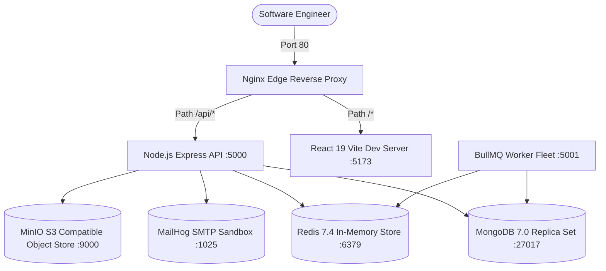
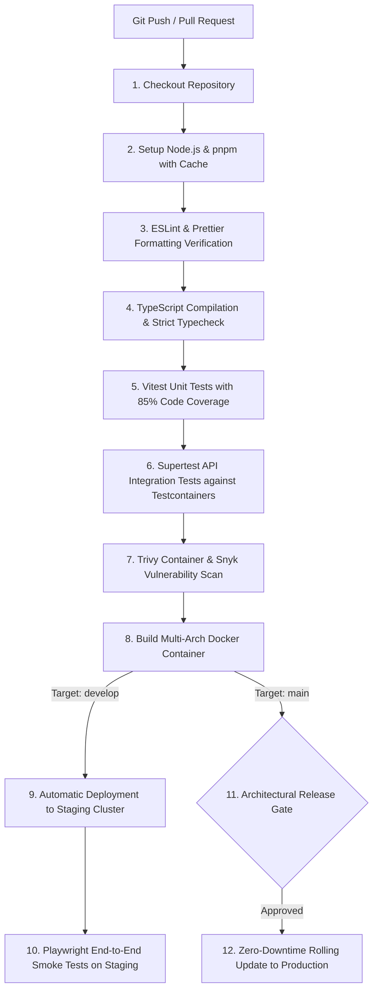
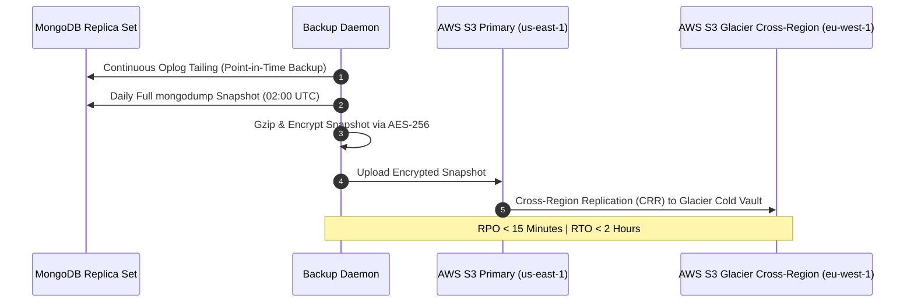

# DEVOPS_ARCHITECTURE.md — DevOps, Infrastructure & CI/CD Blueprint

**System Name:** EduSphere ERP  
**Document Version:** 1.0.0  
**Phase:** Phase 0 — Architecture & Engineering Blueprint  
**Infrastructure Target:** Containerized (Docker, Kubernetes-Ready, AWS/GCP Compatible)

---

## 1. Local Development Environment & Compose Architecture

To ensure parity between developer workstations and production clusters, the entire stack runs locally under Docker Compose:



### 1.1 Local `docker-compose.yml` Service Matrix

1. `api`: Node.js Express server with live reload via `tsx watch`.
2. `web`: React Vite development server with Hot Module Replacement (HMR).
3. `worker`: BullMQ background job processor consuming asynchronous tasks.
4. `mongodb`: Standalone MongoDB 7 instance initialized as a single-node replica set (required for multi-document ACID transactions).
5. `redis`: Redis 7 server configured with `appendonly yes` persistence.
6. `minio`: S3-compatible mock object store simulating AWS S3 presigned uploads locally.
7. `mailhog`: Local mock SMTP server with a web UI on port 8025 to inspect outgoing student/parent emails.

---

## 2. Production Docker Architecture & Multi-Stage Builds

Production containers follow strict security practices: Alpine-based minimal footprints, multi-stage compilation, and execution under an unprivileged user (`node`).

### 2.1 Production API `Dockerfile` Standard

```dockerfile
# ==========================================
# Stage 1: Build Dependencies & Source Code
# ==========================================
FROM node:22-alpine AS builder
WORKDIR /app

# Install build dependencies
RUN apk add --no-cache libc6-compat python3 make g++

# Install pnpm package manager
RUN corepack enable && corepack prepare pnpm@latest --activate

# Copy root workspace configurations
COPY package.json pnpm-lock.yaml pnpm-workspace.yaml turbo.json ./
COPY apps/api/package.json ./apps/api/
COPY packages/common/package.json ./packages/common/
COPY packages/database/package.json ./packages/database/

# Install full dependencies (including devDependencies)
RUN pnpm install --frozen-lockfile

# Copy application source files
COPY apps/api ./apps/api
COPY packages/common ./packages/common
COPY packages/database ./packages/database
COPY tsconfig.base.json ./

# Compile TypeScript to minified JavaScript
RUN pnpm --filter @edusphere/api build
RUN pnpm --filter @edusphere/api --prod deploy pruned-app

# ==========================================
# Stage 2: Minimal Production Runtime
# ==========================================
FROM node:22-alpine AS runner
WORKDIR /app

# Install dumb-init for proper signal forwarding and PID 1 zombie reaping
RUN apk add --no-cache dumb-init

ENV NODE_ENV=production
ENV PORT=5000

# Run as unprivileged non-root user
USER node

# Copy compiled assets and pruned production dependencies
COPY --chown=node:node --from=builder /app/pruned-app/node_modules ./node_modules
COPY --chown=node:node --from=builder /app/apps/api/dist ./dist
COPY --chown=node:node --from=builder /app/apps/api/package.json ./package.json

EXPOSE 5000

# Health check probes
HEALTHCHECK --interval=30s --timeout=5s --start-period=10s --retries=3 \
  CMD wget --no-verbose --tries=1 --spider http://localhost:5000/api/v1/health/liveness || exit 1

ENTRYPOINT ["/usr/bin/dumb-init", "--"]
CMD ["node", "dist/server.js"]
```

---

## 3. GitHub Actions CI/CD Pipeline Standard

Every Pull Request and commit to `main` or `develop` triggers an automated verification and delivery pipeline:



---

## 4. Environment Strategy & Configuration Management

Configuration is strictly validated at application startup using **Zod**. If an engineer or pipeline fails to supply a mandatory environment variable, the application crashes immediately with a descriptive error before opening listening ports.

### 4.1 Environment Configuration Blueprint (`.env.example`)

```bash
# ==========================================
# SYSTEM CORE
# ==========================================
NODE_ENV=development                    # development | test | staging | production
PORT=5000
API_PREFIX=/api/v1
APP_NAME=EduSphere-ERP
FRONTEND_URL=http://localhost:5173

# ==========================================
# DATABASE & REDIS
# ==========================================
DATABASE_URL=mongodb://localhost:27017/edusphere_dev?replicaSet=rs0
DATABASE_MAX_POOL_SIZE=50
REDIS_URL=redis://localhost:6379
REDIS_KEY_PREFIX=edusphere:

# ==========================================
# SECURITY & AUTHENTICATION
# ==========================================
JWT_ACCESS_SECRET=replace_with_256_bit_secure_random_key_min_32_chars
JWT_ACCESS_EXPIRY=15m
JWT_REFRESH_SECRET=replace_with_another_256_bit_random_key
JWT_REFRESH_EXPIRY=7d
COOKIE_DOMAIN=localhost
COOKIE_SECURE=false                     # true in staging/production

# ==========================================
# OBJECT STORAGE (S3 / MINIO)
# ==========================================
STORAGE_PROVIDER=MINIO                  # MINIO | AWS_S3 | CLOUDINARY
AWS_REGION=us-east-1
AWS_S3_BUCKET=edusphere-media-storage
AWS_ACCESS_KEY_ID=minioadmin
AWS_SECRET_ACCESS_KEY=minioadmin
AWS_S3_ENDPOINT=http://localhost:9000

# ==========================================
# EMAIL & NOTIFICATION GATEWAYS
# ==========================================
EMAIL_PROVIDER=SMTP                     # SMTP | SES | SENDGRID
SMTP_HOST=localhost
SMTP_PORT=1025
SMTP_USER=
SMTP_PASS=
DEFAULT_FROM_EMAIL=notifications@edusphere.io

# ==========================================
# PAYMENT GATEWAYS
# ==========================================
PAYMENT_DEFAULT_GATEWAY=RAZORPAY        # RAZORPAY | STRIPE
RAZORPAY_KEY_ID=rzp_test_placeholder
RAZORPAY_KEY_SECRET=rzp_secret_placeholder
STRIPE_SECRET_KEY=sk_test_placeholder
STRIPE_WEBHOOK_SECRET=whsec_placeholder

# ==========================================
# OBSERVABILITY & LOGGING
# ==========================================
LOG_LEVEL=info                          # debug | info | warn | error
SENTRY_DSN=
```

---

## 5. Git Branching Strategy & Code Review Standards

1. **Branch Model (Modified GitHub Flow):**
   - `main`: Represents production-ready code. Directly protected. Deployments trigger automatically upon tagging a release (`v1.0.0`).
   - `develop`: Integration branch for tested feature work.
   - `feat/<module>-<description>`: Isolated feature branches (e.g. `feat/attendance-rfid-sync`).
   - `fix/<module>-<issue>`: Bugfix branches (e.g. `fix/fees-gst-rounding`).
   - `hotfix/<version>`: Emergency production hotfix branched directly from `main`.
2. **Commit Standard (Conventional Commits):**
   - Structure: `<type>(<scope>): <subject>`
   - Examples:
     - `feat(admissions): add document upload and verification stage`
     - `fix(payroll): correct employee provident fund rounding formula`
     - `perf(attendance): add compound index on section and date`
3. **Pull Request Quality Gates:**
   - Minimum 1 Senior/Staff Engineer approval required.
   - Zero unresolved discussions.
   - 100% CI pipeline green (Linter, Typecheck, Unit Tests, Integration Tests).

---

## 6. Backup & Disaster Recovery Architecture



- **Recovery Point Objective (RPO):** < 15 minutes via continuous MongoDB oplog streaming.
- **Recovery Time Objective (RTO):** < 2 hours via automated Terraform container spin-up and point-in-time restore scripts.
- **Cold Storage Retention:** Daily snapshots retained for 30 days; monthly institutional snapshots retained in AWS Glacier Vault for 7 years to meet statutory tax and educational compliance mandates.
