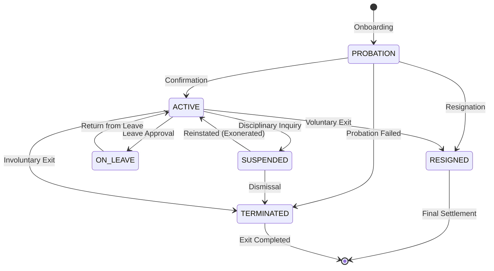

# Employee Lifecycle & State Machine Architecture (Phase 6)

## 1. Overview & State Machine Design

The Employee Lifecycle in EduSphere ERP is governed by a deterministic state machine enforcing strict organizational transitions, referential integrity, and cascading security side effects.



---

## 2. Transition Matrix & Rules

| Current Status | Permitted Target Statuses                         | Required Metadata                        | Security Side Effects                                              |
| :------------- | :------------------------------------------------ | :--------------------------------------- | :----------------------------------------------------------------- |
| `PROBATION`    | `ACTIVE`, `RESIGNED`, `TERMINATED`                | `confirmationDate` (if ACTIVE), `reason` | If terminated: revoke all active sessions.                         |
| `ACTIVE`       | `ON_LEAVE`, `SUSPENDED`, `RESIGNED`, `TERMINATED` | `reason`, `exitDate` (if exit)           | If suspended/resigned/terminated: revoke all sessions immediately. |
| `ON_LEAVE`     | `ACTIVE`                                          | `reason`                                 | Restores standard active status.                                   |
| `SUSPENDED`    | `ACTIVE`, `TERMINATED`                            | `reason`                                 | If reinstated: user account reactivated.                           |
| `RESIGNED`     | _Terminal state (no transitions)_                 | -                                        | -                                                                  |
| `TERMINATED`   | _Terminal state (no transitions)_                 | -                                        | -                                                                  |

---

## 3. Cascading Security Enforcement

When an employee transitions to an unauthorized or inactive state (`SUSPENDED`, `RESIGNED`, `TERMINATED`):

1. **User Account Synchronization**:
   - The associated `User` record's `status` is transitioned to `SUSPENDED` or `INACTIVE`.
2. **Session Eviction**:
   - All active refresh tokens in MongoDB are stamped with `revokedAt = new Date()`.
   - Redis user session keys (`sessions:{userId}`) are deleted immediately.
3. **Immutability of Terminal Records**:
   - Resigned or terminated employees cannot be reassigned or modified without explicit administrative reinstatement.
4. **Audit Trail**:
   - Every transition generates an immutable audit record capturing `previousStatus`, `newStatus`, `reason`, `changedBy`, and `timestamp`.

---

## 4. API Endpoints for Status Transitions

### Status Transition Request

`POST /api/v1/employees/:id/status`

**Request Payload:**

```json
{
  "status": "SUSPENDED",
  "reason": "Pending disciplinary inquiry into academic conduct violation."
}
```

**Success Response (HTTP 200):**

```json
{
  "success": true,
  "data": {
    "id": "6aa287ae79032ac11739947e",
    "employeeId": "EMP-2026-0005",
    "firstName": "Arthur",
    "lastName": "Pendelton",
    "status": "SUSPENDED",
    "statusHistory": [
      {
        "previousStatus": "ACTIVE",
        "newStatus": "SUSPENDED",
        "reason": "Pending disciplinary inquiry into academic conduct violation.",
        "changedAt": "2026-09-10T10:45:00.000Z"
      }
    ]
  },
  "message": "Employee status transitioned to SUSPENDED. Associated user account and active sessions have been revoked."
}
```

**Error Response on Invalid Transition (HTTP 400):**

```json
{
  "success": false,
  "error": {
    "code": "INVALID_STATUS_TRANSITION",
    "message": "Cannot transition employee status from TERMINATED to ACTIVE. Terminal states cannot be transitioned."
  }
}
```
