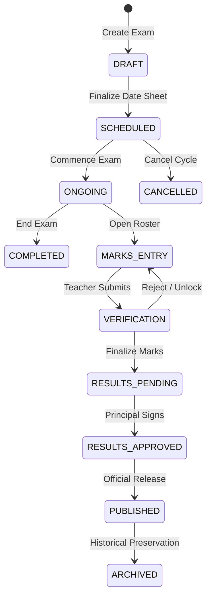

# Examination Management Architecture & Lifecycle

## 1. Overview
The Examination Management subsystem in EduSphere ERP orchestrates institution-wide assessment cycles across campuses, academic years, classes, and subjects. It is built to support diverse examination models (Unit Tests, Mid-Terms, Finals, Practical Assessments, Internal Assessments) with strict state machine validation, auditable grade changes, and tamper-proof publication.

## 2. Exam Lifecycle State Machine
Examinations progress through deterministic, auditable states:

### Valid Status Transitions
- `DRAFT` ➔ `SCHEDULED`, `CANCELLED`
- `SCHEDULED` ➔ `ONGOING`, `DRAFT`, `CANCELLED`
- `ONGOING` ➔ `COMPLETED`, `MARKS_ENTRY`, `CANCELLED`
- `COMPLETED` ➔ `MARKS_ENTRY`, `ARCHIVED`
- `MARKS_ENTRY` ➔ `VERIFICATION`, `ONGOING`
- `VERIFICATION` ➔ `MARKS_ENTRY`, `RESULTS_PENDING`, `COMPLETED`
- `RESULTS_PENDING` ➔ `RESULTS_APPROVED`, `VERIFICATION`
- `RESULTS_APPROVED` ➔ `PUBLISHED`, `RESULTS_PENDING`
- `PUBLISHED` ➔ `ARCHIVED`
- `CANCELLED` ➔ `ARCHIVED`

## 3. Core Entities & Data Architecture

### `Exam` Document
- `tenantId`, `schoolId`, `campusId`: Multi-tenant partition keys.
- `academicYearId`: Bound academic calendar year.
- `title`, `code`: Human-readable identifier and unique institutional code.
- `examType`: `UNIT_TEST`, `PERIODIC_TEST`, `MID_TERM`, `HALF_YEARLY`, `PRE_BOARD`, `FINAL`, `PRACTICAL`, `INTERNAL_ASSESSMENT`.
- `status`: Current state machine phase (`ExamStatus`).
- `startDate`, `endDate`: Master exam window.
- `academicClassIds`: Participating academic classes.
- `gradingSchemeId`: Active evaluation scale.
- `passingPercentage`: Standard passing threshold (default: 40%).
- `weightagePercentage`: Contribution to final cumulative term grade.

## 4. Multi-Tenant Scoping & Security
- All read, write, and transition queries enforce `{ tenantId, isDeleted: false }`.
- Examinations in `DRAFT` state are editable and deletable by administrators.
- Once transitioned to `SCHEDULED` or later, structural mutations are locked to protect paper schedule integrity.
