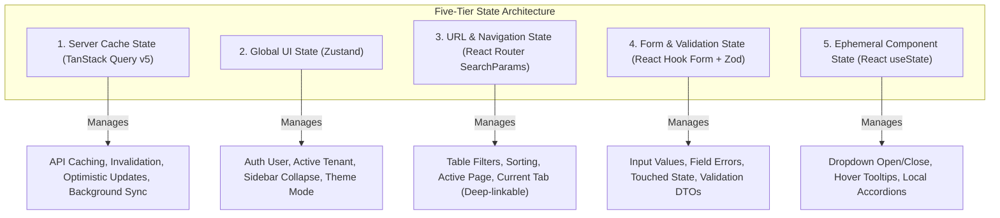
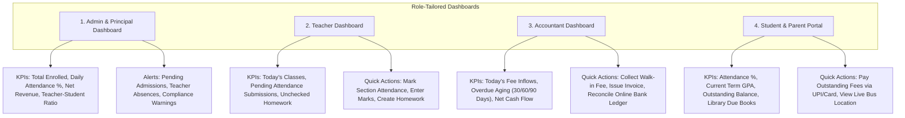

# FRONTEND_ARCHITECTURE.md — Web Application Architecture & Design System

**System Name:** EduSphere ERP  
**Document Version:** 1.0.0  
**Phase:** Phase 0 — Architecture & Engineering Blueprint  
**Framework:** React 19 + TypeScript 5.6+  
**Build Tool:** Vite 5.4+  
**Styling & Primitives:** Tailwind CSS 3.4+ & Radix UI Primitives  

---

## 1. Architectural Philosophy & Separation of Concerns

The frontend is architected as an enterprise-grade Single Page Application (SPA) designed to load in under 1.2 seconds, render dense data tables with zero frame drops, and guarantee strict type safety across all API interactions.

### 1.1 The Anti-Pattern: Monolithic Global Redux Store
In traditional frontend architectures, engineers place all server data, form inputs, modal flags, and pagination indices into a single sprawling Redux store. This causes:
* Excessive component re-renders across unaffected screens.
* Complex boilerplate (actions, reducers, sagas, selectors).
* Cache invalidation bugs where stale student data persists after an edit.

### 1.2 The EduSphere Five-Tier State Strategy
We strictly segment frontend state into five isolated layers based on lifecycle and ownership:



---

## 2. Feature-Sliced Directory Structure

The application code is organized by business feature domain rather than technical types:

```
apps/web/src/
├── app/
│   ├── routes/              # Top-level route configuration & lazy-loaded layouts
│   ├── providers/           # QueryClientProvider, AuthProvider, I18nProvider, ThemeProvider
│   └── App.tsx              # Root app component with global error boundary
├── assets/                  # Static brand assets, SVG icons, illustration SVGs
├── components/              # Reusable Enterprise Design System primitives
│   ├── ui/                  # Button, Input, Select, Dialog, Drawer, Badge, Skeleton (Radix-backed)
│   ├── feedback/            # ToastProvider, ErrorState, EmptyState, ConfirmDialog
│   ├── layout/              # AppHeader, AppSidebar, TenantSwitcher, PageHeader, Breadcrumbs
│   └── tables/              # DataTable, VirtualizedTable, PaginationBar, TableColumnVisibility
├── features/                # Domain Feature Slices (100% self-contained)
│   ├── auth/                # Login, MFA challenge, password reset, session recovery
│   ├── students/            # Profile lists, enrollment forms, student detail views
│   ├── attendance/          # Daily section grid, RFID sync logs, absence alert modals
│   ├── fees/                # Invoice lists, receipt printer, payment gateway modal
│   ├── exams/               # Exam scheduling, marks entry grid, report card generator
│   └── ... (other features adhere to identical internal structure)
│       ├── api/             # TanStack Query useQuery / useMutation hooks & Axios endpoints
│       ├── components/      # Feature-specific components (e.g. MarksEntryGrid, FeeInvoiceRow)
│       ├── hooks/           # Feature-specific business hooks (e.g. useCalculateBalance)
│       ├── types/           # Domain TypeScript interfaces and API response shapes
│       └── pages/           # Routed view components for this feature
├── hooks/                   # Cross-cutting global hooks (useAuth, useTenant, usePermission)
├── lib/                     # Configured Axios instance, token interceptor, date utilities
├── stores/                  # Lightweight Zustand stores (useAuthStore, useUIStore)
└── types/                   # Global TypeScript types and utility types
```

---

## 3. Enterprise SaaS Design System & UI/UX Standards

### 3.1 Design Tokens & Typography
* **Typography:** System font stack with **Inter** primary (`font-sans`).
  * `xs`: 12px (Data table secondary text, badges)
  * `sm`: 14px (Standard table cells, form labels, input values)
  * `base`: 16px (Body copy, card headers)
  * `lg`: 18px (Section titles, modal headings)
  * `xl`: 20px (Page headings)
  * `2xl`: 24px (Dashboard metrics and KPI numerals)
* **Spacing Grid:** Strict 4px/8px grid system (`p-1`, `p-2`, `p-4`, `p-6`, `p-8`). Arbitrary margins (`mt-[17px]`) are rejected by linter.
* **Color Palette (Accessible High-Contrast):**
  * `Primary`: Slate Blue / Deep Indigo (`#1e293b` to `#4338ca`) for trust and legibility.
  * `Success`: Emerald Green (`#059669`) for collected payments and attendance presence.
  * `Warning`: Amber (`#d97706`) for overdue payments and pending leaves.
  * `Destructive`: Crimson Red (`#dc2626`) for absences, unpaid invoices, and disciplinary actions.
  * `Neutral / Surface`: Crisp whites and neutral slates (`#f8fafc` to `#0f172a`) with dark-mode parity.

### 3.2 Component Catalog Standards
1. **Interactive Data Tables (`DataTable`):**
   * Built on **TanStack Table v8** and **React Virtual**.
   * Capable of rendering 1,000+ student rows at 60 FPS via DOM virtualization.
   * Standard capabilities: Sticky header, sortable columns, multi-select checkboxes for batch actions (e.g. "Send SMS to Selected"), column visibility toggle, and instant CSV/Excel export.
2. **Accessible Modals & Drawers (`Dialog`, `Sheet`):**
   * Built on Radix UI primitives.
   * Enforces focus traps: Tabbing cannot escape the modal until dismissed. Pressing `Escape` closes the dialog.
   * Screen readers announce modal appearance via `aria-modal="true"`.
3. **Skeleton Loaders & Empty States:**
   * No generic spinning spinners. Content renders pulsating skeleton cards mirroring the exact layout of data tables and dashboard metric tiles.
   * Empty states feature an illustrative icon, a descriptive headline (e.g., "No Students Found in Section B"), and a direct primary Call-to-Action button ("Enroll New Student").

---

## 4. Role-Specific Dashboard Specifications

Every dashboard view is tailored strictly to the operational workflow of the authenticated user:



---

## 5. Accessibility (WCAG 2.1 AA) & Internationalization (i18n)

### 5.1 Accessibility Checklist
* **Keyboard Navigation:** 100% of workflows (attendance submission, fee collection, navigation) operable via keyboard alone (`Tab`, `Shift+Tab`, `Space`, `Enter`, `Arrow` keys).
* **Color Contrast:** All text elements adhere to a minimum 4.5:1 contrast ratio against their background (verified via automated Axe-core CI tests).
* **Focus Indicators:** Explicit, high-visibility 2px focus rings (`focus-visible:ring-2 focus-visible:ring-indigo-500 focus-visible:ring-offset-2`).

### 5.2 Internationalization Architecture
* Powered by `react-i18next` with decoupled, namespace-organized JSON translation catalogs:
  ```json
  {
    "students": {
      "enrollmentTitle": "Student Enrollment",
      "admissionNumber": "Admission Number",
      "dateOfBirth": "Date of Birth",
      "validation": {
        "required": "This field is mandatory."
      }
    }
  }
  ```
* Initial locale: `en-US`.
* Architecture is future-ready for `hi-IN` (Hindi) and `ar-SA` (Arabic RTL directionality configured via CSS logical properties: `ms-*`, `me-*` instead of `ml-*`, `mr-*`).
