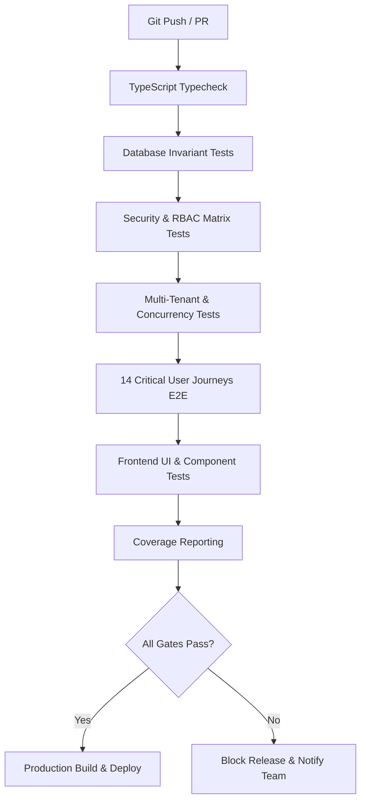

# CI/CD Quality Gates & Release Policy

## Overview
This document specifies the automated quality engineering gates enforced for every pull request and release build within the EduSphere ERP platform. Any failure of a gate immediately blocks the deployment pipeline.

---

## 1. Quality Gates Matrix

| Gate ID | Quality Gate Description | Target Threshold | Enforcement Mechanism |
|---------|--------------------------|------------------|-----------------------|
| **QG-01** | Database Domain Invariants | 100% Pass Rate | `npm run test --workspace=@edusphere/database` |
| **QG-02** | Security & Auth Matrix | 100% Pass Rate | `npm run test:security --workspace=@edusphere/api` |
| **QG-03** | Multi-Tenant Data Isolation | 100% Pass Rate | `apps/api/tests/multitenant.matrix.test.ts` |
| **QG-04** | Concurrency & Race Conditions | 100% Pass Rate | `npm run test:concurrency --workspace=@edusphere/api` |
| **QG-05** | Financial Integrity & Integer Math | 100% Pass Rate | `apps/api/tests/financial.integrity.test.ts` |
| **QG-06** | 14 Critical User Journeys (CUJ) | 100% Pass Rate | `npm run test:e2e --workspace=@edusphere/api` |
| **QG-07** | Frontend Component & Routing Tests | 100% Pass Rate | `npm run test --workspace=@edusphere/web` |
| **QG-08** | Code Coverage Thresholds | Lines: >= 80%, Branches: >= 75% | `npm run test:coverage` |
| **QG-09** | Type Safety & Zero Compilation Errors | 0 TypeScript Errors | `npm run typecheck` |
| **QG-10** | Flake Detection & Retry Limits | Max 0 flakiness tolerance | Retries disabled in release builds (`--bail=1`) |

---

## 2. Invariant Policies & Release-Blocking Rules

1. **Zero Business Logic in Tests**:
   - Tests must validate behavior against existing API contracts and DB models. No test may introduce dummy mocks that fake business logic verification.

2. **Strict Multi-Tenant Query Validation**:
   - Every read and write query in multi-tenant models must either go through the tenant context plugin or explicitly query by `tenantId`. Cross-tenant queries are fatal violations.

3. **Financial Immutability**:
   - Zero floating-point calculations are permitted in currency fields. All fees, invoices, payments, and balances must be in minor currency integer units.

4. **Flake Quarantine Procedure**:
   - If a test exhibits intermittent failure:
     - Mark with isolated runner.
     - Reproduce concurrency or timing condition locally with stress harness.
     - Replace static timers (`setTimeout`) with deterministic state polling or promise resolution.
     - Tests relying on arbitrary sleep durations are prohibited.

---

## 3. Pipeline Execution Sequence

