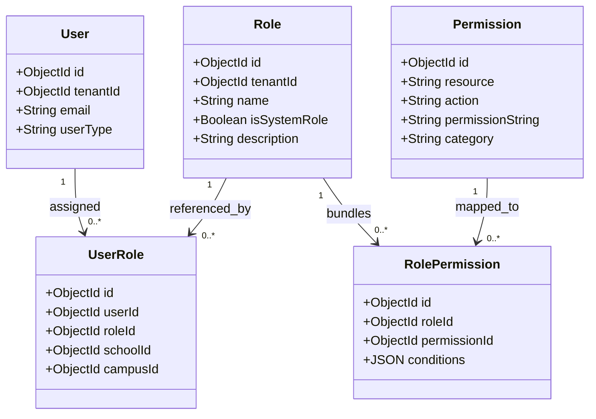
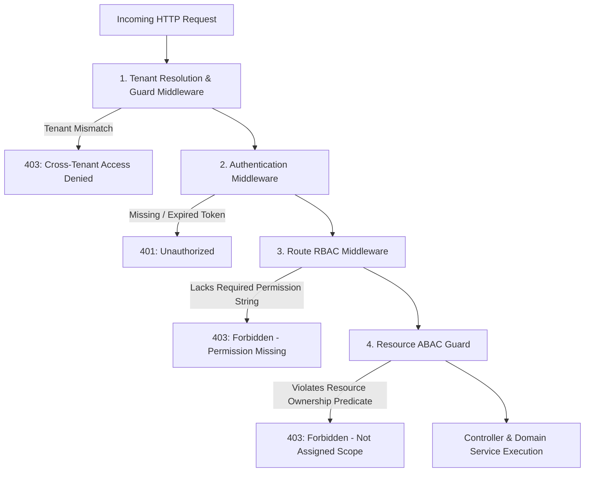

# RBAC_MATRIX.md — Role-Based & Attribute-Based Access Control Architecture

**System Name:** EduSphere ERP  
**Document Version:** 1.0.0  
**Phase:** Phase 0 — Architecture & Engineering Blueprint  
**Access Model:** Hybrid RBAC + ABAC (Resource Ownership Constraints)

---

## 1. Access Control Philosophy & Decoupled Model

### 1.1 The Anti-Pattern: Hardcoded Role Verification

Hardcoded checks such as `if (req.user.role === 'ADMIN')` are strictly prohibited. Hardcoded checks cause catastrophic rigidity:

- Institutional clients cannot customize staff capabilities (e.g., granting a Vice Principal billing read access or allowing a Senior Teacher to approve attendance).
- Multi-role personnel (e.g., an employee who is both a Teacher and a Parent of an enrolled student) break the system.

### 1.2 The Decoupled Identity & Permission Metamodel



- **Permission:** Atomic operational capability formatted as `resource:action` (e.g., `student:create`, `fee_invoice:void`).
- **Role:** A named bundle of permissions. System roles are pre-seeded templates (e.g., `TEACHER`), while School Admins can create Custom Roles (e.g., `EXAM_COORDINATOR`, `ACADEMIC_HEAD`).
- **UserRole:** Connects a `User` to a `Role`, optionally scoped to a specific `schoolId` or `campusId`.
- **Conditions (ABAC Layer):** Fine-grained predicate rules (e.g., `{ "ownClassOnly": true }` ensures a teacher can only modify attendance for their assigned section).

---

## 2. Granular Permission Catalog

The platform defines **158 fine-grained permissions** categorized by functional domain:

### Academic, Student & Guardian Operations (Phase 8 Expanded)

- **Student Core & Lifecycle**: `student:create`, `student:read`, `student:update`, `student:delete`, `student:admit`, `student:activate`, `student:suspend`, `student:transfer`, `student:withdraw`, `student:graduate`, `student:archive`, `student:view_pii`
- **Guardian Directory & Profiles**: `guardian:create`, `guardian:read`, `guardian:update`, `guardian:delete`
- **Student-Guardian Relationships**: `relationship:create`, `relationship:read`, `relationship:update`, `relationship:delete`
- **Student Document Vault**: `student_document:create`, `student_document:read`, `student_document:verify`, `student_document:delete`
- **Enrollment & Roll Numbers**: `enrollment:create`, `enrollment:read`, `enrollment:update`, `enrollment:delete`, `student:enroll`, `student:update_enrollment`
- **Admissions Pipeline**: `admission:create`, `admission:read`, `admission:review`, `admission:approve`, `admission:reject`
- **Grade & Class Levels**: `class:create`, `class:read`, `class:update`, `class:delete`, `class:manage`
- **Class Sections & Divisions**: `section:create`, `section:read`, `section:update`, `section:delete`, `section:manage`
- **Academic Class Offerings**: `academic_class:create`, `academic_class:read`, `academic_class:update`, `academic_class:delete`, `academic_class:manage`
- **Subject Master Catalog**: `subject:create`, `subject:read`, `subject:update`, `subject:delete`, `subject:manage`
- **Class-Subject Curriculum**: `class_subject:create`, `class_subject:read`, `class_subject:update`, `class_subject:delete`, `class_subject:manage`
- **Teacher Allocations**: `teacher_assignment:create`, `teacher_assignment:read`, `teacher_assignment:update`, `teacher_assignment:delete`, `teacher_assignment:manage`
- **Timetable (Phase 9)**: `timetable:create`, `timetable:read`, `timetable:update`, `timetable:publish`

### Daily Tracking & Classroom

- `attendance:mark`, `attendance:read`, `attendance:update`, `attendance:lock`, `attendance:export`
- `homework:create`, `homework:read`, `homework:update`, `homework:grade`, `homework:submit`

### Examination & Grading

- `exam:create`, `exam:read`, `exam:schedule`, `exam:publish`, `exam:lock`
- `marks:entry`, `marks:verify`, `marks:override`, `report_card:generate`, `report_card:publish`

### Financial & Billing

- `fee_structure:create`, `fee_structure:read`, `fee_structure:update`, `fee_structure:delete`
- `fee_invoice:create`, `fee_invoice:read`, `fee_invoice:update`, `fee_invoice:void`
- `payment:collect`, `payment:read`, `payment:refund`, `finance_ledger:read`, `finance_ledger:manage`

### Human Resources & Payroll

- `teacher:manage`, `staff:manage`, `leave:apply`, `leave:approve`, `payroll:calculate`, `payroll:disburse`

### Auxiliary & Operations

- `library:manage_catalog`, `library:issue_book`, `library:return_book`, `library:collect_fine`
- `transport:manage_fleet`, `transport:assign_route`, `hostel:manage_rooms`, `hostel:allocate_bed`
- `inventory:manage_items`, `inventory:create_po`, `announcement:publish`, `audit:read`

---

## 3. Comprehensive Role-Permission Matrix

Below is the definitive baseline matrix for the **14 standard system roles**:

| Permission Area / Code                      | SUPER ADMIN | SCHOOL ADMIN | PRINCIPAL | VICE PRINCIPAL | TEACHER | ACCOUNTANT | HR MGR | LIBRARIAN | TRANSPORT MGR | HOSTEL MGR | RECEPTIONIST | STAFF | STUDENT | PARENT |
| :------------------------------------------ | :---------: | :----------: | :-------: | :------------: | :-----: | :--------: | :----: | :-------: | :-----------: | :--------: | :----------: | :---: | :-----: | :----: |
| **Tenant Provisioning (`tenant:*`)**        |     ✅      |      ❌      |    ❌     |       ❌       |   ❌    |     ❌     |   ❌   |    ❌     |      ❌       |     ❌     |      ❌      |  ❌   |   ❌    |   ❌   |
| **School Config (`school:*`)**              |     ✅      |      ✅      |    👁️     |       👁️       |   ❌    |     ❌     |   ❌   |    ❌     |      ❌       |     ❌     |      ❌      |  ❌   |   ❌    |   ❌   |
| **RBAC Management (`rbac:*`)**              |     ✅      |      ✅      |    ❌     |       ❌       |   ❌    |     ❌     |   ❌   |    ❌     |      ❌       |     ❌     |      ❌      |  ❌   |   ❌    |   ❌   |
| **Student Profiles (`student:create/del`)** |     ✅      |      ✅      |    ✅     |       ✅       |   ❌    |     ❌     |   ❌   |    ❌     |      ❌       |     ❌     |      ❌      |  ❌   |   ❌    |   ❌   |
| **Student Profiles (`student:read`)**       |     ✅      |      ✅      |    ✅     |       ✅       |   👁️*   |     👁️     |   👁️   |    👁️     |      👁️       |     👁️     |      👁️      |  ❌   |   👁️*   |  👁️*   |
| **Student Profiles (`student:update`)**     |     ✅      |      ✅      |    ✅     |       ✅       |   ❌    |     ❌     |   ❌   |    ❌     |      ❌       |     ❌     |      ❌      |  ❌   |   ❌    |   ❌   |
| **Admissions (`admission:approve`)**        |     ✅      |      ✅      |    ✅     |       ❌       |   ❌    |     ❌     |   ❌   |    ❌     |      ❌       |     ❌     |      ❌      |  ❌   |   ❌    |   ❌   |
| **Attendance (`attendance:mark/edit`)**     |     ✅      |      ✅      |    ✅     |       ✅       |   ✅*   |     ❌     |   ❌   |    ❌     |      ❌       |     ❌     |      ❌      |  ❌   |   ❌    |   ❌   |
| **Attendance (`attendance:read`)**          |     ✅      |      ✅      |    ✅     |       ✅       |   ✅    |     👁️     |   👁️   |    ❌     |      👁️       |     👁️     |      👁️      |  ❌   |   👁️*   |  👁️*   |
| **Attendance (`attendance:submit`)**        |     ✅      |      ✅      |    ✅     |       ✅       |   ✅*   |     ❌     |   ❌   |    ❌     |      ❌       |     ❌     |      ❌      |  ❌   |   ❌    |   ❌   |
| **Attendance (`attendance:approve/lock`)**   |     ✅      |      ✅      |    ✅     |       ✅       |   ❌    |     ❌     |   ❌   |    ❌     |      ❌       |     ❌     |      ❌      |  ❌   |   ❌    |   ❌   |
| **Attendance Corrections (`attendance:correct`)** |   ✅    |      ✅      |    ✅     |       ✅       |   ✅*   |     ❌     |   ❌   |    ❌     |      ❌       |     ❌     |      ❌      |  ❌   |   ❌    |   ❌   |
| **Correction Review (`attendance:correct:review`)** | ✅    |      ✅      |    ✅     |       ✅       |   ❌    |     ❌     |   ❌   |    ❌     |      ❌       |     ❌     |      ❌      |  ❌   |   ❌    |   ❌   |
| **Attendance Reports (`attendance:report:read`)** |  ✅    |      ✅      |    ✅     |       ✅       |   ✅    |     👁️     |   ❌   |    ❌     |      ❌       |     ❌     |      👁️      |  ❌   |   ❌    |   ❌   |
| **Homework (`homework:create/grade`)**      |     ✅      |      ✅      |    👁️     |       👁️       |   ✅*   |     ❌     |   ❌   |    ❌     |      ❌       |     ❌     |      ❌      |  ❌   |   ❌    |   ❌   |
| **Homework (`homework:submit`)**            |     ❌      |      ❌      |    ❌     |       ❌       |   ❌    |     ❌     |   ❌   |    ❌     |      ❌       |     ❌     |      ❌      |  ❌   |   ✅*   |   ❌   |
| **Exams (`exam:create/schedule`)**          |     ✅      |      ✅      |    ✅     |       ✅       |   ❌    |     ❌     |   ❌   |    ❌     |      ❌       |     ❌     |      ❌      |  ❌   |   ❌    |   ❌   |
| **Marks (`marks:entry`)**                   |     ✅      |      ✅      |    ✅     |       ✅       |   ✅*   |     ❌     |   ❌   |    ❌     |      ❌       |     ❌     |      ❌      |  ❌   |   ❌    |   ❌   |
| **Marks (`marks:verify/publish`)**          |     ✅      |      ✅      |    ✅     |       ❌       |   ❌    |     ❌     |   ❌   |    ❌     |      ❌       |     ❌     |      ❌      |  ❌   |   ❌    |   ❌   |
| **Timetable Master (`timetable:*`)**        |     ✅      |      ✅      |    ✅     |       ✅       |   👁️    |     ❌     |   ❌   |    ❌     |      ❌       |     ❌     |      ❌      |  ❌   |   👁️    |   👁️   |
| **Period Schedules (`period:*`)**           |     ✅      |      ✅      |    ✅     |       ✅       |   👁️    |     ❌     |   ❌   |    ❌     |      ❌       |     ❌     |      ❌      |  ❌   |   👁️    |   👁️   |
| **Classroom Facilities (`classroom:*`)**     |     ✅      |      ✅      |    ✅     |       ✅       |   👁️    |     ❌     |   ❌   |    ❌     |      ❌       |     ❌     |      ❌      |  ❌   |   👁️    |   👁️   |
| **Timetable Slots (`timetable_entry:*`)**    |     ✅      |      ✅      |    ✅     |       ✅       |   👁️*   |     ❌     |   ❌   |    ❌     |      ❌       |     ❌     |      ❌      |  ❌   |   👁️*   |  👁️*   |
| **Fee Structures (`fee_structure:*`)**      |     ✅      |      ✅      |    👁️     |       ❌       |   ❌    |     ✅     |   ❌   |    ❌     |      ❌       |     ❌     |      ❌      |  ❌   |   ❌    |   ❌   |
| **Fee Invoices (`fee_invoice:create`)**     |     ✅      |      ✅      |    ❌     |       ❌       |   ❌    |     ✅     |   ❌   |    ❌     |      ❌       |     ❌     |      ❌      |  ❌   |   ❌    |   ❌   |
| **Fee Invoices (`fee_invoice:read`)**       |     ✅      |      ✅      |    👁️     |       👁️       |   ❌    |     ✅     |   ❌   |    ❌     |      ❌       |     ❌     |      ❌      |  ❌   |   👁️*   |  👁️*   |
| **Payments (`payment:collect`)**            |     ✅      |      ✅      |    ❌     |       ❌       |   ❌    |     ✅     |   ❌   |    ❌     |      ❌       |     ❌     |      ❌      |  ❌   |   ❌    |   ❌   |
| **Payments (`payment:refund/void`)**        |     ✅      |      ✅      |    ❌     |       ❌       |   ❌    |    ✅*     |   ❌   |    ❌     |      ❌       |     ❌     |      ❌      |  ❌   |   ❌    |   ❌   |
| **Staff & Payroll (`payroll:*`)**           |     ✅      |      ✅      |    👁️     |       ❌       |   ❌    |     👁️     |   ✅   |    ❌     |      ❌       |     ❌     |      ❌      |  ❌   |   ❌    |   ❌   |
| **Leave Approval (`leave:approve`)**        |     ✅      |      ✅      |    ✅     |       ✅       |   ❌    |     ❌     |   ✅   |    ❌     |      ❌       |     ❌     |      ❌      |  ❌   |   ❌    |   ❌   |
| **Library Management (`library:*`)**        |     ✅      |      ✅      |    👁️     |       👁️       |   ❌    |     ❌     |   ❌   |    ✅     |      ❌       |     ❌     |      ❌      |  ❌   |   👁️*   |  👁️*   |
| **Transport Fleet (`transport:*`)**         |     ✅      |      ✅      |    👁️     |       👁️       |   ❌    |     ❌     |   ❌   |    ❌     |      ✅       |     ❌     |      ❌      |  ❌   |   👁️*   |  👁️*   |
| **Hostel Management (`hostel:*`)**          |     ✅      |      ✅      |    👁️     |       👁️       |   ❌    |     ❌     |   ❌   |    ❌     |      ❌       |     ✅     |      ❌      |  ❌   |   👁️*   |  👁️*   |
| **Announcements (`announcement:pub`)**      |     ✅      |      ✅      |    ✅     |       ✅       |   ✅*   |     ❌     |   ❌   |    ❌     |      ❌       |     ❌     |      ❌      |  ❌   |   ❌    |   ❌   |
| **Audit Logs (`audit:read`)**               |     ✅      |      ✅      |    👁️     |       ❌       |   ❌    |    👁️*     |   ❌   |    ❌     |      ❌       |     ❌     |      ❌      |  ❌   |   ❌    |   ❌   |

**Legend:**

- ✅ : Full Create / Read / Update / Delete permissions
- 👁️ : Read-Only access across all institutional records
- 👁️* : Read-Only restricted strictly to **Self / Assigned Records** (ABAC rule)
- ✅* : Action allowed strictly within assigned scope (e.g., teacher for assigned section only; accountant refund requires secondary approval)
- ❌ : Access Denied (HTTP 403 Forbidden)

---

## 4. Multi-Tier Authorization Enforcement Architecture



### 4.1 Code Implementation Architecture

1. **Route-Level Permission Guard (`requirePermission`):**
   ```typescript
   router.post(
     '/classes/:classId/sections/:sectionId/attendance',
     authenticateJwt,
     requirePermission('attendance:mark'),
     validateClassSectionAssignment, // ABAC Guard
     attendanceController.markDailyAttendance
   );
   ```
2. **Resource-Level Attribute Guard (`validateClassSectionAssignment`):**
   - If user is a `TEACHER`, the middleware checks whether `req.user.teacherProfile.assignedSections` contains `req.params.sectionId`. If not, it halts with `403 Forbidden: Teacher is not assigned to this class section`.
3. **Tenant Guard (`verifyTenantAccess`):**
   - Verifies that `req.user.tenantId.toString() === req.tenantContext.tenantId.toString()`. Cross-tenant queries are blocked before reaching any controller or service.
