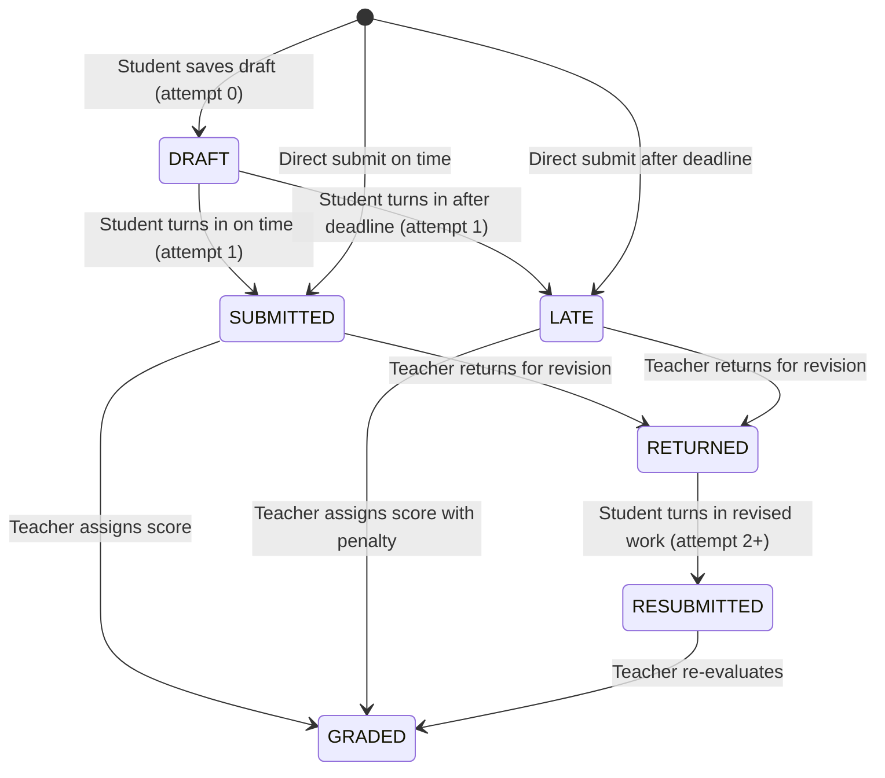

# SUBMISSION_MANAGEMENT.md — Student Submission Mechanics, Drafts, Policies & Concurrency

**Document Version:** 1.0.0  
**Active Phase:** Phase 11 — Homework & Assignment Management  
**Date:** September 14, 2026  
**Status:** Production Grade  

---

## 1. Submission Lifecycle State Machine

Each student submission progresses through defined states:



---

## 2. Drafts vs Official Submissions

- **Saving a Draft (`POST /api/v1/assignments/:id/submissions/draft`)**:
  - Sets `status: DRAFT` and `attemptNumber: 0`.
  - Does NOT snapshot into `attempts[]`.
  - Is NOT visible in teacher grading queues.
  - Allows students to incrementally compose text and attach files before final submission.
- **Official Submission (`POST /api/v1/assignments/:id/submissions`)**:
  - Increments `attemptNumber` (starting at 1).
  - Pushes an immutable snapshot entry into `attempts[]`:
    ```typescript
    {
      attemptNumber: nextAttempt,
      submittedAt: new Date(),
      content,
      attachments,
      isLate,
      status: isLate ? SubmissionStatus.LATE : SubmissionStatus.SUBMITTED,
    }
    ```
  - Appears immediately on the teacher's grading roster.

---

## 3. Late Submission & Deadline Enforcement

Submissions are evaluated against the parent Assignment's timing policies:

1. **On-Time Submissions**:
   - `now <= dueDate`: marked `SUBMITTED`, `isLate = false`.
2. **Late Submissions Allowed (`allowLateSubmission = true`)**:
   - `now > dueDate`: marked `LATE`, `isLate = true`.
   - If `lateSubmissionDeadline` is defined and `now > lateSubmissionDeadline`, the submission is rejected (`400 Bad Request: Late submission cutoff deadline has passed`).
3. **Late Submissions Disallowed (`allowLateSubmission = false`)**:
   - `now > dueDate`: rejected (`400 Bad Request: Submissions are closed. The deadline has passed.`).

---

## 4. Concurrency & Idempotency Safeguards

To handle double-clicks, network retries, and distributed race conditions:

1. **Unique Compound Index**:
   - `{ tenantId: 1, assignmentId: 1, studentId: 1 }` guarantees only one submission record can exist for a student per assignment.
2. **Idempotency Key Handling**:
   - Clients supply an optional `idempotencyKey` header or body parameter.
   - If a concurrent request triggers MongoDB Error 11000, `assignment.service.ts` catches the collision and retrieves the existing record, returning an idempotent `200 OK` rather than failing.
3. **Draft-to-Submit Atomicity**:
   - When converting a draft to a submission, `findOneAndUpdate` or atomic document update preserves previous draft state and increments attempt counters accurately.
