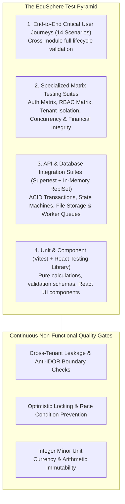

# TESTING_STRATEGY.md — Comprehensive Quality Assurance & Verification Architecture

**System Name:** EduSphere ERP  
**Document Version:** 2.0.0 (Phase 23 Established)  
**Target Code Coverage:** > 85% Branch & Statement Coverage on Core Domain Services  

---

## 1. The Quality Assurance Pyramid & Test Philosophy

EduSphere enforces a production-grade testing pyramid ensuring that zero functional, security, concurrency, or multi-tenant regressions escape to production:



---

## 2. Test Layer Specifications & Implementation Stack

| Test Tier | Technology Stack | Scope & Focus | Verification Path |
| :--- | :--- | :--- | :--- |
| **Unit & Calculation** | Vitest 2.1+ | Money arithmetic, Zod schemas, state machines, pure domain functions | `packages/common`, `packages/types` |
| **Component & Frontend** | RTL + Vitest + jsdom | 21 UI suites covering dashboards, modals, permissions, forms | `apps/web/src/__tests__/*.test.tsx` (138 tests) |
| **Database Domain Invariants** | Vitest + In-Memory MongoDB ReplSet | Multi-document ACID transactions, soft delete, compound indexes | `packages/database/tests/*.test.ts` (97 tests) |
| **API Integration & Security** | Supertest + Express App | REST APIs, route guards, token validation, audit emission | `apps/api/tests/*.test.ts` |
| **Matrix Test Suites** | Dual-Tenant Harness + 15 Personas | Auth, RBAC, Multi-tenancy, Concurrency, Financial, State machines, Storage | `apps/api/tests/*.matrix.test.ts` |
| **14 Critical User Journeys** | End-to-End API Workflows | 14 institutional journeys from onboarding to compliance search | `apps/api/tests/e2e.user.journeys.test.ts` |

---

## 3. Fixture & Factory Architecture (`apps/api/tests/factories/`)

Test data generation is strictly standardized using deterministic, schema-aligned factories to eliminate brittle mocks:

1. **Entity Factories (`entity.factories.ts`)**:
   - Covers 40+ domain entities across Organization, Academic, Attendance, Exams, Finance, HR, Library, Transport, Hostel, Inventory, and Communication.
   - Built-in schema defaults with override capabilities, preventing schema mismatch drift.

2. **Persona Factories (`persona.factories.ts`)**:
   - 15 authentic institutional personas (`superAdmin`, `tenantAdmin`, `schoolAdmin`, `academicCoordinator`, `principal`, `headOfDepartment`, `teacher`, `classTeacher`, `librarian`, `accountant`, `transportManager`, `hostelWarden`, `student`, `parent`, `auditor`).
   - Automatically provisions authenticated User, associated domain profile, JWT bearer token, and full RBAC permission matrices.

3. **Dual-Tenant Environment Factory (`environment.factory.ts`)**:
   - Instantiates isolated Tenant A and Tenant B alongside sibling schools to test multi-tenancy and data isolation deterministically.

---

## 4. Specialized Quality Suites (Phase 23)

### 4.1 Auth Security Matrix (`tests/auth.matrix.test.ts`)
- 14 tests verifying token tamper resistance (alg: none, asymmetric HMAC attacks, token expiration, blacklisted tokens, rate limit brute-force lockout, and tenant claim validation).

### 4.2 RBAC Permission Matrix (`tests/rbac.matrix.test.ts`)
- 6 tests validating positive grant execution, negative privilege denial, least privilege across 15 personas, and forbidden wildcard privilege escalation.

### 4.3 Multi-Tenant Isolation Matrix (`tests/multitenant.matrix.test.ts`)
- 8 tests verifying cross-tenant read/write prevention, sibling school cross-talk prevention, anti-IDOR checks on student records, and query leak defense.

### 4.4 Concurrency & Race Condition Matrix (`tests/concurrency.matrix.test.ts`)
- 6 tests validating simultaneous seat allocation, double-spend fee payments, concurrent library checkouts, hostel bed double-booking, and attendance record locking.

### 4.5 Financial Integrity & Arithmetic Immutability (`tests/financial.integrity.test.ts`)
- 6 tests validating integer minor units, zero-floating point drift, subtotal line-item reconciliation, over-refund prevention, and payment receipt ledger consistency.

### 4.6 State Machine Transitions (`tests/state.machine.test.ts`)
- 14 tests validating lifecycle progressions and illegal backward/invalid transitions across Attendance, Invoices, Homework, and Examination results.

### 4.7 File Storage & Worker Queue Isolation (`tests/storage.worker.test.ts`)
- 7 tests validating magic-byte MIME validation, path traversal defense, file size limits, worker retry backoff, and dead-letter queue routing.

### 4.8 14 End-to-End Critical User Journeys (`tests/e2e.user.journeys.test.ts`)
- 14 tests covering the complete institutional lifecycle from School Onboarding, Staff Setup, Student Registration, Curriculum Allocation, Roll Call, Homework, Exams, Fees, Library, Transport, Hostel, Inventory, Announcements, to Compliance Audits.

---

## 5. Standardized Test Execution Commands

```bash
# Full test execution across all workspaces
npm run test

# Specialized API quality suites
npm run test:unit --workspace=@edusphere/api
npm run test:integration --workspace=@edusphere/api
npm run test:security --workspace=@edusphere/api
npm run test:concurrency --workspace=@edusphere/api
npm run test:e2e --workspace=@edusphere/api
npm run test:coverage --workspace=@edusphere/api

# Database domain invariant suite
npm run test --workspace=@edusphere/database

# Frontend component & UI suite
npm run test --workspace=@edusphere/web
```
