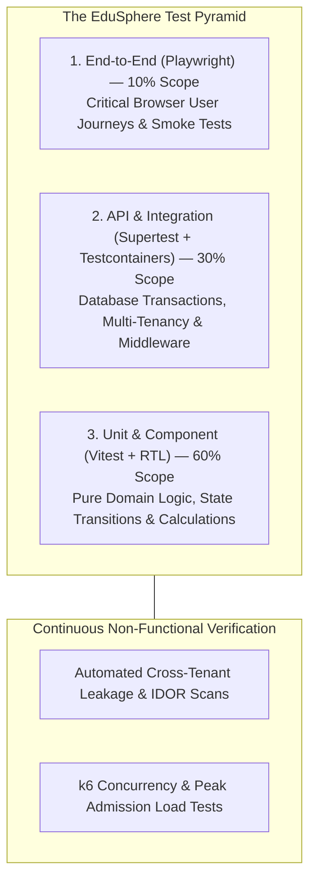

# TESTING_STRATEGY.md — Comprehensive Quality Assurance & Verification Architecture

**System Name:** EduSphere ERP  
**Document Version:** 1.0.0  
**Phase:** Phase 0 — Architecture & Engineering Blueprint  
**Target Code Coverage:** > 85% Branch & Statement Coverage on Core Domain Services  

---

## 1. The Quality Assurance Pyramid

To maintain high development velocity without compromising stability, EduSphere enforces a structured Testing Pyramid:



---

## 2. Test Layer Specifications & Stack Selection

| Test Tier | Technology Stack | Scope & Focus | Execution Velocity |
| :--- | :--- | :--- | :--- |
| **Unit Tests** | **Vitest 2.0+** | Pure functions, financial calculators, Zod schema validation, state machine transition rules. | Instant (< 50ms per suite) |
| **Component Tests** | **React Testing Library + Vitest** | UI primitives, table filtering, modal focus traps, form validation feedback. | Fast (< 300ms per component) |
| **API Integration** | **Supertest + Testcontainers / mongodb-memory-server** | Full Express middleware stack, real MongoDB ACID transactions, Redis caching, RBAC permissions. | Medium (1 - 3s per suite) |
| **E2E Tests** | **Playwright** | Complete browser automation: parent fee payment flow, teacher attendance marking, login MFA. | Moderate (15 - 30s per flow) |
| **Load Tests** | **k6 (Grafana)** | Stress testing high-concurrency peak events (report card publishing, fee deadlines). | On-demand / Nightly |
| **Security Tests** | **Custom Vitest Security Suite + OWASP ZAP** | Intentional cross-tenant queries, token tampering, parameter pollution, NoSQL payloads. | Pre-merge CI Gate |

---

## 3. Critical Automated Test Suites

### 3.1 Cross-Tenant Isolation Security Suite (Non-Negotiable CI Gate)
Every Pull Request executes an automated cross-tenant security verification test. If any endpoint returns data belonging to another tenant, the entire CI pipeline halts:

```typescript
// sample test concept: test/integration/security/tenant-isolation.spec.ts
describe('Security: Cross-Tenant Data Isolation Guard', () => {
  it('should strictly reject Tenant B user attempting to fetch Tenant A student record', async () => {
    // 1. Seed Student under Tenant A
    const tenantAStudent = await seedStudent({ tenantId: tenantA._id });

    // 2. Authenticate as School Admin of Tenant B
    const tenantBToken = generateAuthToken({
      userId: tenantBAdmin._id,
      tenantId: tenantB._id,
      roles: ['SCHOOL_ADMIN']
    });

    // 3. Attempt direct fetch using Tenant A student ID
    const response = await request(app)
      .get(`/api/v1/students/${tenantAStudent._id}`)
      .set('Authorization', `Bearer ${tenantBToken}`)
      .set('X-Tenant-Domain', 'tenant-b.edusphere.io');

    // 4. Assert: Must return 404 NOT_FOUND (never 200, and never leak existence)
    expect(response.status).toBe(404);
    expect(response.body.success).toBe(false);
    expect(response.body.error.code).toBe('RESOURCE_NOT_FOUND');
  });
});
```

### 3.2 Financial & Transactional Integrity Suite
1. **Invoice Idempotency:** Submitting duplicate payment webhook payloads with identical `gatewayTransactionId` must result in exactly one payment ledger entry.
2. **Double-Entry Ledger Balance:** Sum of all debit entries in general ledger vouchers must exactly equal credit entries (`debits - credits === 0`).
3. **Atomic Rollback Verification:** Simulating a database disconnection midway through an admission creation must roll back the `User`, `Student`, and `FeeInvoice` without leaving orphaned documents.

---

## 4. Performance & Load Testing Architecture (k6)

High-volume scenarios are validated using k6 scripts simulating real-world school stress events:

* **Scenario 1: The 8:30 AM Morning Attendance Surge**
  * Profile: 500 concurrent teachers submitting section attendance simultaneously.
  * Target: 100% submission success rate; p95 response time < 250ms.
* **Scenario 2: The Annual Report Card Publishing Spike**
  * Profile: 3,000 concurrent parents and students downloading compiled PDF report cards.
  * Architecture Check: Static PDFs served directly from Cloudflare CDN / S3 presigned caches without overwhelming Node.js event loop.
* **Scenario 3: Fee Due-Date Payment Rush**
  * Profile: 1,200 concurrent payment gateway webhook receptions.
  * Target: Zero deadlocks; Redis sliding-window queue absorbs bursts.
